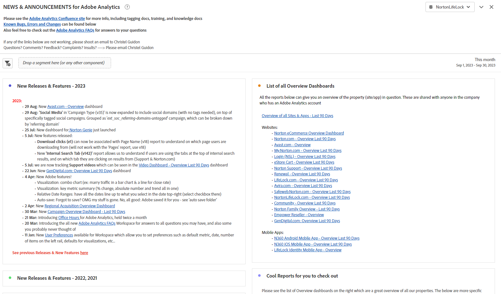

# Creazione di dashboard operativi in Analysis Workspace

_Scopri in che modo le dashboard operative di [!DNL Adobe Analytics] Workspace rivoluzionano la comunicazione e l&#39;efficienza. Scopri come creare dashboard di domande frequenti, notizie e annunci e bug e funzionalità per semplificare le informazioni, migliorare l’esperienza utente e migliorare il coinvolgimento._

Come molti amministratori, eseguo un hub di informazioni interno (Confluence o simile) per [!DNL Adobe Analytics]. Nel tempo, mi sono stufato di rispondere alle stesse domande ripetutamente e avevo bisogno di un modo più fluido per raggiungere i miei utenti senza sentirmi come se stessi suonando e infastidendoli continuamente. Avevo bisogno di archivi per informazioni meno statiche.

Ho notato che gli utenti spesso ignoravano i miei riferimenti al sito di Confluence, con motivi come &quot;La mia VPN è spenta&quot;, o &quot;Non posso leggerla ora&quot;, ecc. In sostanza, &quot;Leggerò quel documento più tardi&quot; significa che non verrà mai letto, e la stessa domanda verrà posta di nuovo la prossima settimana.

***L&#39;hit di realizzazione:**la versatilità di Workspace potrebbe cambiare le carte in tavola. Gli utenti preferiscono risposte rapide e dirette all&#39;interno di Workspace, pertanto è opportuno evitare ulteriori passaggi.*

Sono andato avanti e ho creato dashboard operativi per condividere a livello aziendale. Finora, hanno tenuto gli utenti informati, centralizzato le informazioni e ridotto la frustrazione. Si è trattato di un processo semplice ed evolutivo che migliora l&#39;efficienza nel tempo.

Le persone sono state in grado di ottenere un sacco di buone informazioni senza di me, capire le aree del sito, vedere quanto è bello [!DNL Adobe Analytics] e (importante per me ??) farmi meno domande e prendere meno tempo.

**È consigliabile creare dashboard per tutte le proprietà o le aree principali del sito.** Devono fornire una panoramica della proprietà/del sito/dell&#39;app/del flusso e disporre di informazioni di base e di informazioni rapide. Devono essere condivise con l’intera azienda, consentendo a tutti gli utenti di comprendere la proprietà senza alcuna presa di mano. Per me, queste dashboard di solito rispondono all&#39;80% delle domande che ricevo e mi fanno risparmiare tempo prezioso.

Niente di tutto questo ti impedisce di mantenere il tuo sito Confluence, che rimane molto utile da avere. Faccio anche riferimento a esso nella parte superiore di ogni dashboard operativo. Ma adoro le scelte rapide, sia per me che per i miei utenti.

Lasciate che vi mostri i tre dashboard operativi che ho creato per la mia azienda, GenDigital, che mi hanno aiutato a raggiungere questi obiettivi.

1. Domande frequenti
1. Novità e annunci
1. Registro Bug, funzioni e versioni principali

## 1 - Dashboard delle domande frequenti

Stanchi dell&#39;infinito circolo di risposte ripetute? Fermatevi! Risparmia tempo creando una dashboard di domande frequenti. Gli utenti possono consultarlo prima di chiedere, oppure puoi collegarlo rapidamente alle tue risposte.

È sufficiente creare [visualizzazioni di testo](https://experienceleague.adobe.com/docs/analytics/analyze/analysis-workspace/visualizations/text.html) con domande formattate come titoli e risposte/spiegazioni come contenuto, il tutto compresso per mostrare solo la domanda. Raggruppali per rilevanza (ad esempio, pagine o prodotti) o utilizzare i pannelli. Semplificalo, dando priorità alle query comuni nella parte superiore.

Invece di scrivere e-mail lunghe o riscoprire spiegazioni precedenti, aggiorna la dashboard delle domande frequenti. Inizia ora ed espandi nel tempo. Utilizza i collegamenti ipertestuali per fare riferimento ad altre dashboard o a domande frequenti correlate all’interno dei rapporti. Fornisci contesto complesso quando necessario, collegando da altre dashboard a FAQ.

Per Gen Digital, le nostre domande frequenti si concentrano sull&#39;uso personalizzato di [!DNL Adobe Analytics], non sulle nozioni di base. Per inviare e-mail di collegamento a domande frequenti specifiche, fai clic con il pulsante destro del mouse, seleziona &quot;Ottieni collegamento di visualizzazione&quot; e condividi l’URL personalizzato. Questo evidenzia il contenuto esatto per gli utenti. Utilizza le tabelle a forma libera per le illustrazioni dei dati, aggiungendo ulteriori spiegazioni con &quot;modifica descrizione&quot;.

Quando le domande frequenti saranno complete, condividile con l’azienda per un accesso e un apprendimento collettivi. Continua a migliorare secondo necessità.

Ecco alcune schermate dell’aspetto di una dashboard di domande frequenti:

## 2 - Dashboard per notizie e annunci

Un’altra utile dashboard operativa è una dashboard di notizie e annunci. Ho iniziato questa pagina perché volevo che i miei utenti ricevessero informazioni, ma mi sembrava invece di darle fastidio. È necessario aggiornare tutti? Quali utenti? Solo per utenti esperti? Dovrei inviare una newsletter settimanale che nessuno leggerà? Grazie all’aggiornamento direttamente in Workspace, gli utenti possono visualizzarlo non appena accedono e non è necessario inviare un’altra e-mail aziendale che nessuno desidera leggere.

Poiché queste dashboard sono visibili a livello aziendale, gli aggiornamenti arrivano immediatamente all’inizio. Ecco il tipo di informazioni da includere nella dashboard news e annunci:

- Versioni future e aggiornamenti sul nostro lato (principalmente versioni del codice)
- Nuove funzionalità importanti di [!DNL Adobe]
- Orario ufficio
- Elenco di tutte le dashboard di panoramica e dei rapporti interessanti da estrarre

Include le nuove funzionalità, il tracciamento e le dashboard vitali. I collegamenti ipertestuali nei report di testo (o in cima ad altri report tramite il pulsante destro del mouse e modifica descrizione) consentono di collegarsi ad altre dashboard nella pagina di rilascio delle funzionalità di [!DNL Adobe Analytics] o [!DNL Adobe].

Ecco come si presenta la dashboard Notizie e annunci:

## 3 - Registro bug, funzioni e versioni principali

L’obiettivo di questa dashboard operativa è disporre di una posizione centrale per inserire tutti i bug e gli errori. In precedenza gestivo il problema in Excel, ma era difficile e complicato condividerlo. Perché non inserirlo direttamente in Workspace?

Puoi integrarlo nella dashboard Notizie e annunci se desideri che sia meno prominente. Tuttavia, se la segnalazione di bug è importante o critica per la tua azienda, un dashboard separato potrebbe essere saggio.

Uso una visualizzazione di testo e la mantengo molto semplice con i punti elenco. Il punto elenco viene preceduto dalla data del bug e dalla proprietà (ad esempio: &#39;3jan23-17jan23 - Norton.com&#39;, &#39;Before to 14sep22 - Chat&#39;). Poi aggiungo i dettagli e cerco di mantenerli brevi e concisi. Non è necessario indicare il team in errore ed evitare di aggiungere troppi dettagli tecnici che non interessano agli utenti.

Il bug più recente si trova nella parte superiore, mentre quelli più vecchi si trovano nei rapporti di testo annuali (ad esempio, &quot;2022 - Bug noti, errori e modifiche&quot;) - tutti compressi.

Niente di speciale. Molto facile da fare, e si deve ammettere, molto meglio di quel file Excel che si tiene sul disco rigido e continuare ad aggiornare su Confluence.

Faccio riferimento anche a dashboard di panoramica e report interessanti qui, come per altre dashboard operative. I collegamenti alle domande frequenti e alle dashboard di notizie e annunci sono verso l’alto.

Di seguito è riportato un esempio di registro:

La creazione di dashboard operativi in [!DNL Adobe Analytics] Workspace ha rappresentato per me un punto di svolta. Come molti amministratori, ho gestito un hub interno e ho lottato con la duplicazione delle risposte e una comunicazione utente efficace. La necessità di archivi dinamici ha portato alla consapevolezza che la versatilità di Workspace poteva rivoluzionare il coinvolgimento. Spero che tu accetti la potenza dei dashboard operativi in [!DNL Adobe Analytics] Workspace. Migliora l’esperienza degli utenti, risparmia tempo e goditi un ambiente più organizzato. Il percorso inizia ora e queste dashboard sono le chiavi per l’efficienza e la facilità d’uso.

## Autore

Questo documento è stato scritto da:

**Christel Guidon**, Digital [!DNL Analytics] Platform Manager presso Gen

[!DNL Adobe Analytics] campione
