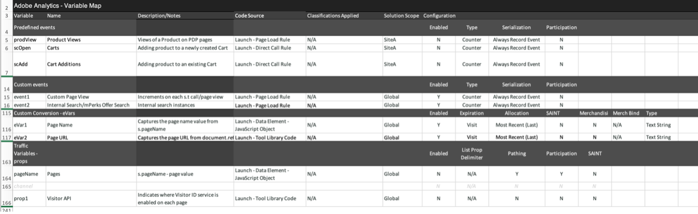

# Scarica il playbook di implementazione di [!DNL Adobe Analytics]

Prima di iniziare, [scarica il playbook](assets/aa-implementation-playbook.xlsx).

## Scheda Requisiti aziendali

**COSA:** Un documento sui requisiti aziendali (BRD, Business Requirements Doc) è una risorsa molto importante per la cui realizzazione sarà importante coinvolgere le principali parti interessate, utenti aziendali e utenti tecnici. Consente di documentare tutti i KPI desiderati, i requisiti di reporting e qualsiasi punto dati che si desidera visualizzare al termine dell&#39;implementazione di [!DNL Adobe Analytics] (AA).

**PERCHÉ:** Questo funge da punto di partenza per la documentazione successiva (SDR, specifiche tecniche, ecc.) ed è una fonte comune di verità per uno stato finale concordato di AA. Questo documento raccoglie le opinioni dei vari team all’interno dell’organizzazione e definisce la direzione da seguire per sviluppare o migliorare l’implementazione.

**COME:** La documentazione dei requisiti aziendali è comunemente preparata dagli utenti aziendali finali di AA, ma è importante ottenere feedback dagli utenti tecnici, in quanto ci possono essere problemi tecnici da considerare e alcuni punti dati possono richiedere più lavoro di altri, e sarà necessario tenerne conto nella definizione delle priorità.

Chiediti, &quot;quali sono le cose che vogliamo monitorare sul nostro sito&quot;, &quot;quali punti dati saranno importanti per me nel reporting&quot; e, soprattutto, &quot;in che modo questi punti dati orienteranno le decisioni&quot;. È importante assicurarsi che ciascuno dei requisiti aziendali si riferisca a un punto dati che possa essere utilizzato per orientare le decisioni aziendali. Ad esempio, potrebbe essere utile tenere traccia di ogni clic sul sito, ma alla fine, quali informazioni acquisisci dai rapporti?

Inizia compilando la colonna C nella schermata seguente (Requisiti aziendali). Ad esempio: &quot;Quante ricerche interne sono state completate sul nostro sito&quot; o &quot;Quale annuncio di campagna interna è più efficace in termini di impression&quot;. Dopo aver inserito questo livello di dettaglio, puoi tornare indietro e compilare la colonna B (Categoria) e raggruppare i requisiti in categorie come &quot;Ricerca&quot; o &quot;Promozione interna&quot; che dovrebbero corrispondere perfettamente alle sezioni delle specifiche tecniche.

Indica inoltre se, utilizzando un eVar, un evento, un prop o una combinazione di questi, si otterrà ciò che si desidera tracciare.

Infine, la colonna Stato di implementazione fungerà da controllo dello stato una volta che inizierai ad aggiungere elementi al sito.

## Scheda Mappa variabili (documento sui tag/SDR)

**COSA:** Un documento sui tag (SDR, Solution Design Reference) è un elemento fondamentale della documentazione, utile sia per gli utenti tecnici che per gli utenti aziendali di AA. Elenca tutte le variabili utilizzate dalle suite di rapporti e tutti i dettagli rilevanti per le impostazioni delle variabili, il modo in cui la variabile viene implementata e il suo scopo nei rapporti. Come il documento sulle proprietà, anche questo dovrebbe essere un documento Excel attivo e ben gestito, con una persona responsabile di mantenerlo aggiornato man mano che vengono introdotti miglioramenti ai tag o modifiche all’implementazione.

**PERCHÉ:** Questo documento ha molti scopi, ma i più importanti sono i seguenti:

* Per tutti i nuovi utenti dell’implementazione (nuovi assunti, responsabili business che desiderano comprendere meglio i rapporti disponibili, ecc.), questo documento fornisce la migliore visione di tutte le variabili implementate e del loro scopo, in modo che gli utenti possano servirsi da soli in termini di apprendimento della configurazione di AA.
* Per l’utente tecnico o proprietario del prodotto AA, questo documento fungerà da promemoria della configurazione di altre variabili e delle variabili disponibili che possono essere utilizzate quando si aggiunge una nuova dimensione.

**COME:** Per iniziare, elenca in un documento Excel tutte le [!DNL Adobe] variabili predefinite (page, product, geo, ecc.), nonché eVar, prop, eventi. Deve essere presente una scheda per sito/suite di rapporti.
Per ciascuna di queste dimensioni, aggiungo le seguenti colonne:

* **Nome:** Fornisci un nome semplice e breve che possa essere compreso dalla maggior parte degli utenti. Questo dovrebbe essere abbastanza intuitivo da consentire a un nuovo utente di sceglierlo e capire cosa intende acquisire la variabile.
* **Descrizione:** Ulteriori dettagli sullo scopo della variabile e sui dati di cui tiene traccia. Lo tengo breve e semplice e lo faccio corrispondere alla descrizione utilizzata nell’interfaccia. Idealmente, non voglio che i miei utenti debbano mai consultare il documento sui tag. Quindi, quando una nuova dimensione viene impostata sul backend di amministrazione, aggiungo lì la stessa descrizione. In questo modo, l’utente può fare clic sull’icona delle informazioni direttamente in Workspace per capire a cosa serve una dimensione, non è necessario consultare un documento Excel.

* **Codice:** il codice del backend che imposta il valore. Questo può essere il campo dal livello dati sulla pagina, oppure puoi richiamarlo con una regola Launch, una regola di elaborazione, ecc.
* **Rapporti di classificazione:** richiama i rapporti di classificazione eseguiti tramite Classification Importer o Classification Rule Builder
* **Ambito della soluzione:** è utile elencare tutte le proprietà (almeno quelle che utilizzano più variabili standard) in colonne di piccole dimensioni e aggiungere un segno di spunta per ogni dimensione impostata su tale proprietà. Questo consente di filtrare facilmente una proprietà specifica e di vedere rapidamente dove viene impostata una particolare dimensione.
* **Configurazione:** impostazioni dell&#39;interfaccia utente amministratore per ogni variabile (ad esempio, per le eVar: scadenza, allocazione, merchandising, ecc.)

Schermata del documento SDR di esempio:

Si consiglia inoltre di utilizzare questo documento sui tag per tenere traccia di eventuali variabili libere e non più valide. Quando una dimensione non è più utile, in genere è necessario un po’ di tempo per eliminarla. Anche dopo questo evento, può verificarsi la memorizzazione in cache, oppure ti puoi rendere conto che la dimensione era stata impostata anche altrove. Pulire le dimensioni non è facile e spesso richiede pazienza. Di seguito sono riportati alcuni suggerimenti per nascondere la posta indesiderata sotto il letto in modo che i tuoi utenti non si confondano mentre ne tengono traccia.

* Tutte le dimensioni/eventi non utilizzati sono &quot;liberi&quot; o &quot;in eliminazione&quot;
   * Se negli ultimi 90 giorni la dimensione contiene valori non validi, è &quot;in eliminazione&quot;
   * Se la dimensione è libera e chiara da almeno 90 giorni, è &quot;libera&quot;
   * Contrassegna questi elementi come tali in &quot;Nome&quot; nel documento sui tag, in modo da poterli filtrare facilmente. Nel documento sui tag, tengo questi dati deselezionati (filtro dati di Excel) in modo che gli utenti non li vedano
   * Contrassegna questi elementi come nome eVar nell’interfaccia in modo che gli utenti non li trovino in una ricerca (ad esempio &quot;(v6)&quot;) e rimuovine la descrizione nell’interfaccia
* In questo modo, quando è necessaria una nuova dimensione, puoi facilmente filtrare per ottenere &quot;gratis&quot; nella colonna &quot;Nome&quot; per trovarne una pulita da utilizzare
* Per le dimensioni e gli eventi &quot;in eliminazione&quot;, ti consiglio di tenerne traccia utilizzando Workspace:
   * Crea un progetto visibile agli amministratori che contenga solo 3 tabelle: eVar, prop ed eventi. Ad esempio, io utilizzo &quot;istanze&quot; per le eVar specifiche, mentre per le proprietà creo dei segmenti HIT con, ad esempio, &quot;prop5 esiste&quot;.
   * Imposta la data sugli ultimi 90 giorni
   * Usa quanto sopra come righe nelle 3 tabelle, insieme alle occorrenze
   * Non appena qualcosa arriva a &quot;0&quot;, lo contrassegno come &quot;gratuito&quot; nel documento sui tag e lo rimuovo dal progetto Workspace

In questo modo i dati sono sempre puliti e hai una chiara idea della tua spazzatura.

## Scheda Proprietà

**COSA:** Un documento sulle proprietà deve elencare tutte le tue proprietà digitali: siti Web, app mobili, altri strumenti (chat, feedback, ecc.), indipendentemente dal fatto che tali proprietà siano o meno taggate con [!DNL Adobe Analytics]. Questo dovrebbe fungere da documento centralizzato e attivo per tutti gli utenti aziendali e tecnici.

**PERCHÉ:** In questo modo potrai vedere chiaramente il percorso dell&#39;utente in tutte le tue proprietà digitali e quali funzioni o meno di [!DNL Adobe Analytics]. Potrai quindi definire l&#39;ordine di priorità da seguire per aggiungere i tag alle proprietà a cui mancano. Delineando in questo modo il tuo ecosistema digitale, potrai identificare potenziali opportunità nella strategia di assegnazione tag per avere una visione completa del percorso dell’utente. Ad esempio: è necessaria una suite di rapporti globale per monitorare più domini/siti? È necessario un passaggio dell’ID visitatore da un dominio all’altro o da un’app a un’esperienza ibrida? È necessario aggiornare i filtri URL interni per il tracciamento tra domini diversi?

**COME:** Identifica un proprietario del documento per la governance e un&#39;unica fonte di responsabilità per la gestione degli aggiornamenti.
Elenca quanto segue nella scheda proprietà:

* **Nome proprietà:** Può essere un dominio, un sottodominio, il nome di un&#39;app e così via. Anche all’interno dello stesso dominio, se alcune parti sono gestite separatamente (ad esempio, da un team diverso o con una tecnologia diversa), queste devono essere separate.
* **Collegamento (URL)** alla proprietà, se disponibile
* **Proprietario e contatti:** Elenca il proprietario principale o i contatti per la proprietà
* **Metodo di tag:** Molti di noi hanno implementazioni e metodi di codice diversi (Launch, file JS, AEP, ecc.). Se necessario, puoi suddividerlo ulteriormente (ad esempio in base alla versione del codice o al sistema di gestione dei tag), ma questo ha lo scopo di tenere traccia di tutti i diversi metodi e versioni del codice, dove è necessario aggiornare il codice e come deve essere mantenuto. Se utilizzi [!DNL Adobe] Launch, elenca il nome della proprietà Launch.

Ricorda di includere tutte le proprietà digitali, anche se non sono taggate con [!DNL Adobe Analytics]. Questo ti aiuterà a comprendere il tuo panorama digitale e come gli utenti interagiscono con tutte le tue proprietà.

Si consiglia di mantenere questo documento il più semplice possibile e di non appesantirlo con troppe informazioni in modo che rimanga facile da interpretare da parte di diverse parti dell’organizzazione. [!DNL Analytics] team comprendono spesso il panorama digitale meglio di qualsiasi altro team, quindi questo documento viene spesso utilizzato da altri team e dirigenti per fornire una panoramica completa.

>[!TIP]
>
>Creare una dimensione nome sito/proprietà in [!DNL Adobe Analytics]. Se in [!DNL Adobe Analytics] è presente una dimensione dedicata (in genere un eVar) che identifica il nome del sito o dell&#39;app, sarà possibile eseguire segmentazioni, risolvere problemi, creare suite di rapporti virtuali e così via. I vantaggi sono infiniti, soprattutto quando si combinano più siti in una singola suite di rapporti globale. La chiave consiste nell’assicurarsi che i team di sviluppo impostino sempre questo valore nella dimensione delle proprietà, inclusi tutti i caricamenti di pagina (s.t calls/trackState) e tutti gli eventi personalizzati (s.tl calls/trackAction). Le regole di elaborazione possono essere uno strumento utile per impostare questi valori in modo corretto e coerente.

[Guarda questo video di Doug Moore](https://experienceleague.adobe.com/docs/analytics-learn/tutorials/implementation/implementation-basics/creating-a-business-requirements-document.html){target="_blank"} per ulteriori informazioni sulla compilazione del playbook di implementazione.

## Autori

Questo documento è stato scritto congiuntamente da:

Christel Guidon, Digital [!DNL Analytics] Platform Manager di NortonLifeLock
[!DNL Adobe Analytics] campione

Rachel Fenwick, Consulente senior alle [!DNL Adobe]
