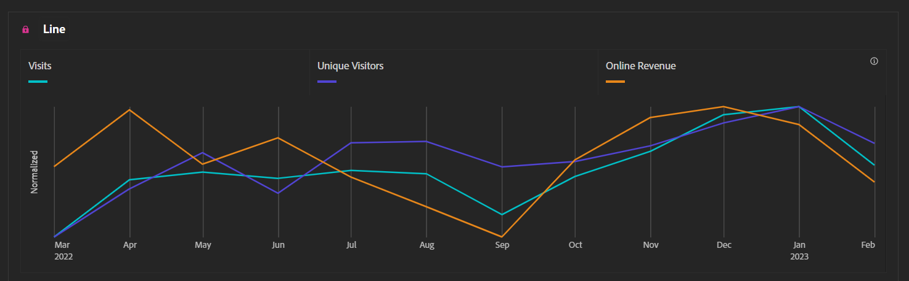

# Favorire il successo con dashboard di riepilogo esecutive

_La dirigenza spesso non dispone di informazioni tempestive e rilevanti per i propri siti e app e si affida a grafici Excel mensili oppure è sommersa da dati granulari. La soluzione: Experience Manager di dashboard di riepilogo di Cloud Manager arketo Engagexecutive._

Immaginate di guidare da Seattle a San Francisco. Dal punto di vista della direzione, è piuttosto facile. Prendi la I-5 South e in 12 a 16 ore sei lì. Semplice, vero? Ora, immaginate che vi abbia messo un pezzo di cartone sul cruscotto e che, solo alla fine del 
viaggio, il vostro cruscotto vi informerà sulla velocità, sul livello di carburante e sulla distanza percorsa:

Se si esamina il grafico, è possibile notare alcuni elementi:

1. La variazione di velocità era notevole, superando di gran lunga il limite legale in alcuni punti, e risultando molto bassa in altri, a causa di fattori come il traffico di Portland

1. La distanza percorsa rimane statica per 6-9 ore

1. Questo perché il carburante è sceso allo 0% e si è dovuto attendere l&#39;assistenza stradale per sbloccare il traffico di Portland e riempire nuovamente di carburante il serbatoio

Un viaggio del genere sarebbe ovviamente scomodo, imprevedibile e pericoloso. Non è certamente il modo giusto di guidare. Per avere il controllo sulla guida, è necessario disporre di informazioni continue sulla velocità, sulla distanza percorsa e sui livelli di carburante. Senza dubbio, una persona ragionevole libererebbe il cruscotto dal cartone e lo controllerebbe regolarmente, ridurrebbe le ore di viaggio, eliminerebbe il rischio di finire il carburante e manterrebbe la guida alla giusta velocità, per evitare eventuali multe.

Allora perché la maggior parte della dirigenza accetta questo come modo ragionevole di gestire i siti e le app?

Il motivo è che non ha accesso alle informazioni pertinenti e continuative necessarie per intervenire in modo tempestivo. Invece, ricevono un deck una volta al mese con le statistiche esportate da [!DNL Adobe Analytics] in Excel, tracciato e quindi inserito in un PowerPoint. Se all&#39;inizio del mese si verifica un punto di flessione, non ne sarà a conoscenza fino all&#39;inizio del mese successivo, ben oltre avere avuto la possibilità di fare domande o intervenire. Anche gli avvisi personalizzati costituiscono un’ottima opzione, ma sappiamo tutti come si presenta una casella di posta elettronica della dirigenza.

Desiderate che la dirigenza abbia dati a sufficienza per sapere quando è richiesta l&#39;attenzione nell&#39;immediato, in modo da non dover alzare le mani in segno di frustrazione. Se leggete un messaggio proveniente dal proprietario di un prodotto o dal responsabile marketing che informa la dirigenza di un&#39;anomalia, avrete trovato il punto debole.

Qui entra in gioco la dashboard di riepilogo esecutiva come mezzo di comunicazione efficace. Sappiamo che la scorecard per dispositivi mobili è un ottimo strumento di controllo rapido per la dirigenza in qualsiasi momento, ma una dashboard di riepilogo esecutiva può semplificare l’accesso per approfondire a coloro che non si muovono mai dalle loro scrivanie. La scorecard per dispositivi mobili può avvisare in merito a un problema, ma la dashboard di riepilogo esecutiva consente una comprensione sufficiente da poter porre le domande giuste alle persone giuste.

La maggior parte della dirigenza deve preoccuparsi seriamente di circa tre KPI. Nel settore della vendita al dettaglio, potrebbe trattarsi di ordini, ricavi e di valore medio dell&#39;ordine (AOV). Per il settore B2B, di lead, qualità di lead e tasso di conversione. Nel settore dei servizi, potrebbero riguardare visite, appuntamenti e visitatori che ritornano. Di qualunque KIP si tratti, metteteli a caratteri cubitali in grassetto, con un cambiamento di anno in anno e un grafico. La visualizzazione Riepilogo delle metriche chiave rende tutto ciò una cosa semplice:

Aggiungete i dati storici per queste tre metriche in modo da visualizzare facilmente le tendenze a lungo termine:

Aggiungete un paio di elenchi a discesa relativi a tutto ciò che è importante per l’ organizzazione. Ritengo che “tipo di dispositivo” e “canale di marketing” siano solitamente ottime scelte:

![Social [!DNL Campaign]s.png](assets/social-campaigns.png)

In generale, questi due aspetti sono molto importanti, ma, come sempre, ci si deve assicurare che la scelta sia pertinente al sito o all’app.

Infine, aggiungete alcuni dettagli in fondo. Ritengo che le prestazioni della pagina siano molto comuni tra la dirigenza, ma la chiave si trova nella parte non visibile della pagina. Se lo desidera, la dirigenza può cercarla altrove, ma in caso contrario dispone dei dati necessari a sollevare immediatamente delle domande:

Con questo prodotto finale a portata di mano, è sufficiente che la dirigenza impari a:

- come leggerlo

- come utilizzare i filtri

- come eseguire un drill-down di base

- Rilassatevi e siate pronti, perché dopo che avrà imparato a trattare con i dati, la dirigenza si rivolgerà a voi con diverse domande

In conclusione, le dashboard di riepilogo esecutive offrono informazioni continue e pertinenti per un processo decisionale tempestivo. I deck mensili con grafici Excel non sono sufficienti e fornire troppi dati granulari può creare confusione nella dirigenza. Un mezzo efficace è concentrarsi sui tre KPI più importanti con dati storici e menu a discesa per i fattori rilevanti. Formando
la dirigenza su come utilizzare la dashboard, le offre la possibilità di prendere decisioni informate e porre le relative domande. Le dashboard di riepilogo esecutive possono migliorare le prestazioni del sito e dell’app e favorirne il successo.

## Autore

Questo documento è stato scritto da:

**Gitai Ben-Ammi**, Principal Consultant di Concentrix Catalyst

[!DNL Adobe Analytics] Campione
