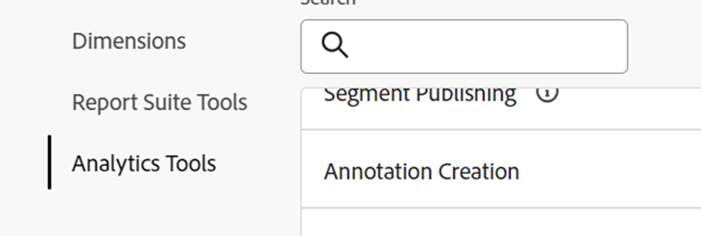

# Sbloccare le informazioni analitiche; sfruttare la potenza delle annotazioni

Il componente dati Annotazioni è una delle funzionalità più semplici, ma a lungo termine è una delle più rapide offerte da Adobe Analysis Workspace. A differenza di qualsiasi altra funzionalità all’interno di Workspace, funge da memoria storica narrativa per te e i tuoi colleghi utenti di Workspace.

In breve, le annotazioni sono testi di descrizione brevi che possono essere aggiunti ai dati con tendenze attuali in Adobe Workspace. Annotations offre contesto a tutti coloro che utilizzano Analysis Workspace per comprendere la cronologia dei dati della tua azienda, aiuta ad analizzare più rapidamente le prestazioni e offre a tutti i tuoi rapporti un aspetto altamente personalizzato.

## Casi d’uso

Esistono diverse situazioni in cui le annotazioni sono particolarmente utili:

- **Outlier (picchi e livelli)** - se conosci il motivo dei picchi e dei livelli più alti dei dati con tendenze, fai clic rapidamente con il pulsante destro del mouse sul punto dati outlier e scegli &quot;Annota selezione&quot; per condividere tale conoscenza con tutti.

- **Campagne di marketing principali e test** - come campagne e test di marketing (A/B, multivariato, ecc.) possono influire direttamente sul traffico e sulle prestazioni, tutti possono facilmente documentare l’arco temporale di tali campagne e test in Annotations.

- **Fattori ed eventi esterni** - qualsiasi cosa, dai principali eventi occasionali alle azioni della concorrenza, alle nuove versioni di prodotti e agli eventi globali o nazionali rilevanti, assicurati di aggiungere eventuali fattori esterni relativi ai dati alle annotazioni.

- **Errori e lacune** - dovresti utilizzare la funzione Avvisi per avvisarti di potenziali problemi di raccolta dei dati, ma anche il team più esperto riscontra sfortunatamente alcune forme di errori di raccolta dei dati o lacune temporanee di tanto in tanto. Le annotazioni sono un ottimo modo per minimizzare l’impatto informando gli utenti che i dati sono mancanti o incompleti.

## Procedure

La creazione e la modifica delle annotazioni è intuitiva e quasi auto-esplicativa. Fai clic con il pulsante destro del mouse su un punto dati all’interno di una visualizzazione con tendenze sulla data o di una tabella a forma libera e scegli &quot;Annota selezione&quot; per creare un’annotazione oppure utilizza la navigazione principale su &quot;Componenti > Annotazioni&quot; per creare e modificare le annotazioni.

{width="70%"}{width="30%"}

Per tutti i dettagli sul funzionamento di Annotations, assicurati di visualizzare l&#39;esercitazione video [su Experience League](https://experienceleague.adobe.com/it/docs/analytics-learn/tutorials/analysis-workspace/navigating-workspace-projects/annotations-in-analysis-workspace).

## Suggerimenti per iniziare

Infine, ecco alcuni suggerimenti utili per iniziare a utilizzare le annotazioni immediatamente.  L’utilizzo di questi suggerimenti contribuirà a rendere le annotazioni efficaci, chiare e informative per tutti gli utenti.

- **Codifica colore** - La funzione Annotazioni consente di selezionare diversi colori da visualizzare nei progetti Workspace per differenziare i vari tipi di annotazioni. Se misuri più siti o app diversi, puoi scegliere un colore diverso per ciascuno. Oppure un colore diverso per ogni categoria di annotazioni.

- **Etichettatura titolo** - Un modo aggiuntivo per fornire agli utenti semplici suggerimenti visivi riguardo un&#39;annotazione consiste nell&#39;etichettare il titolo dell&#39;annotazione. Analogamente alla codifica a colori, puoi scegliere etichette diverse in base alla struttura dei dati nell’organizzazione, ad esempio per canale o nome (ad esempio WEB, APP o ALL)

- **Ambito** - Quando crei un&#39;annotazione, disponi dell&#39;intera gamma di dimensioni, metriche e limitatori per visualizzare le annotazioni nel contesto corretto. Alcune annotazioni sono rilevanti solo per determinate dimensioni o metriche, pertanto puoi limitare il momento in cui un’annotazione viene visualizzata alla dimensione o metrica corrispondente.

- **Salva con nome** - Dopo aver creato un&#39;annotazione o due annotazioni, è possibile riutilizzarle come modelli per creare nuove annotazioni, utilizzando l&#39;opzione &quot;Salva con nome&quot; che consente di risparmiare tempo.

- **Gestione annotazioni**: utilizza la navigazione principale per &quot;Componenti > Annotazioni&quot; e raggiungere Gestione annotazioni, dove troverai funzionalità più estese per creare e soprattutto modificare le annotazioni.

- **Autorizzazioni -** Se non hai la possibilità di creare annotazioni, rivolgiti al tuo amministratore che può consentire la creazione di annotazioni nell&#39;Admin Console.

Per la documentazione dettagliata, visita [Panoramica delle annotazioni](https://experienceleague.adobe.com/it/docs/analytics/analyze/analysis-workspace/components/annotations/overview) e degli articoli circostanti.

## Autore

Questo documento è stato scritto da:

Thomas Edward Buckley, Manager Data Warehouse e Business Intelligence di Miles &amp; More (Lufthansa Group)
