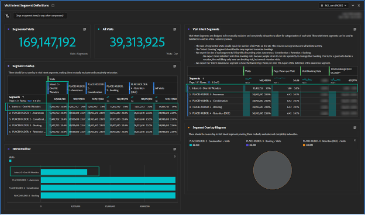

# Creazione di segmenti di Percorso di clienti

Scopri come creare segmenti di percorso dei clienti basati sul comportamento in [!DNL Adobe Analytics] e migliorare l&#39;esperienza dei clienti con [!DNL Adobe] Experience Cloud seguendo questa guida dettagliata.

Creiamo segmenti di percorso di clienti migliori! In questa serie utilizzeremo [!DNL Adobe Analytics] per definire segmenti basati sul comportamento, stimare le dimensioni del pubblico e tenere traccia del movimento degli utenti. Entro la fine, potrai personalizzare i contenuti multimediali e migliorare l&#39;esperienza dei tuoi clienti con l&#39;Experience Cloud [!DNL Adobe]. Tieni presente che questi segmenti sono live e dovrebbero essere aggiornati man mano che apprendi di più sui tuoi clienti. Anche se la generazione rapporti può presentare alcune difficoltà, non preoccuparti, ti guiderò attraverso la documentazione! Iniziamo con la creazione del primo set di segmenti del Percorso di clienti, a partire dal segmento &quot;One Hit Wonders&quot; (Meraviglie in un unico hit).

Oggi creeremo dei segnaposto per il primo set di segmenti del Percorso di clienti, creeremo un Workspace [!DNL Adobe Analytics] per aiutarci a definire i nostri segmenti e il nostro primo segmento, &quot;One Hit Wonders&quot;.

Al termine di questa serie, potrai creare segmenti di percorso clienti in [!DNL Adobe Analytics] in base a segnali comportamentali. Potrai stimare le dimensioni di ogni pubblico in ogni fase del percorso e capire a che velocità gli utenti si spostano tra queste fasi. Potrai esportare i tipi di pubblico del percorso di clienti nell&#39;Experience Cloud [!DNL Adobe] per abilitare la personalizzazione e il targeting multimediale.

Ogni azienda è diversa e questo significa che i segmenti del percorso di clienti avranno un aspetto diverso dal mio. Quindi, anziché prescrivere formule specifiche per i segmenti, suggerisci alcune cose da considerare e un processo complessivo per la loro creazione.

È inoltre importante notare che i segmenti del percorso di clienti saranno segmenti viventi. Non si tratta di un esercizio isolato. Man mano che acquisisci maggiori informazioni sui clienti, aggiorna questi segmenti. Questo presenta alcune difficoltà per quanto riguarda la generazione di rapporti. Le persone desiderano coerenza nei loro rapporti e se le nostre definizioni dei segmenti cambiano, cambieranno anche i numeri nei rapporti.

## Guida introduttiva ai segmenti di intento di visita

Il primo passaggio per creare segmenti di percorso di clienti consiste nel capire perché un ospite si trova sul tuo sito web utilizzando segnali di comportamento e, se disponibili, Voice of Customer data. Creeremo una serie di segmenti di Intento di visita per categorizzare tutte le visite sul sito web. A questo punto, i nostri segmenti Intento di visita devono escludersi a vicenda e risultare completamente esaustivi. Ogni visita deve appartenere a un solo segmento di intento di visita.

I segmenti Intento di visita descrivono una visita; pertanto utilizzeremo il contenitore Visite nella definizione del segmento.

Il mio set iniziale di segmenti di Intento di visita includeva:

* One Hit Wonders
* Consapevolezza
* Considerazione
* Prenotazione (acquisto)
* Mantenimento (gestire una prenotazione/acquisto)

Per semplificare l’utilizzo dei segmenti di Intento visita, ho aggiunto ai nomi dei segmenti il prefisso &quot;Intento:&quot;, ho assegnato loro un numero per abilitare l’ordinamento e ho assegnato loro il tag &quot;Intento&quot;. I miei segmenti erano simili all’immagine qui sotto.

**Procedi e crea i segmenti di intento della visita utilizzando il contenitore Visite con una definizione segnaposto di Visualizzazioni pagina >= 1.**

Come vedremo, la creazione di questi segmenti è un processo iterativo e interconnesso. Descrivo il processo di creazione di questi segmenti in un post futuro.

## Workspace per la qualità dei dati dei segmenti con intento di visita

Ho utilizzato un’area di lavoro semplice per assicurarmi di definire correttamente i segmenti di Intento di visita. Ricorda che ogni visita deve appartenere a un solo segmento di intento di visita. L’area di lavoro che ho configurato assicura che tutte le visite siano contabilizzate e che non ci siano sovrapposizioni tra i segmenti.

Ho denominato questa area di lavoro &quot;QUALITÀ DEI DATI: Segmenti intento visita&quot; con i tag &quot;qualità dei dati&quot;, &quot;intento visita&quot; e &quot;percorso di clienti&quot;. Successivamente verrà creato un &quot;Dashboard intento di visita&quot; in modo che il prefisso &quot;DATA QUALITY&quot; indichi che questa area di lavoro è per la configurazione e la manutenzione dei segmenti. Si tratta di un dashboard amministrativo con informazioni aziendali scarse, ma importante per garantire la manutenzione dei segmenti. È consigliabile tornare regolarmente a questa dashboard, o impostare avvisi, per assicurarsi che i segmenti rimangano definiti correttamente.

La visualizzazione più importante in questa area di lavoro è la visualizzazione a forma libera di sovrapposizione segmenti, in mezzo a sinistra. Utilizzando la metrica Visite, crea filtri di colonna per ciascuno dei segmenti di intento di visita più il segmento Tutte le visite nella colonna più a destra. Crea righe per ciascun segmento Intento visita a sinistra. Ora avrai una visualizzazione cross-tab. Quando i segmenti sono configurati correttamente, ci saranno solo dati in una colonna e una riga, all’intersezione di ogni segmento di intento di visita con se stesso.

Le successive visualizzazioni più importanti sono le metriche di riepilogo in alto a sinistra. Il riepilogo Visite segmentate prende il suo valore dalla colonna Tutte le visite nella visualizzazione Sovrapposizione segmenti immediatamente sotto. Il riepilogo Tutte le visite presenta una propria tabella nascosta.

In alto a destra, ho aggiunto ulteriori metriche a ciascuno dei segmenti per dare un po’ di &quot;sapore&quot; alla forma che assumono i segmenti. In particolare, poiché questi segmenti si escludono a vicenda, mi aspetto di vedere solo le prenotazioni per il segmento Intento di prenotazione (non temere, arriveremo ai tassi di conversione quando creeremo questi segmenti di Intento di visita basati sui visitatori.

Ricorda che abbiamo appena creato dei segmenti segnaposto. Quindi, inizialmente, il tuo spazio di lavoro sarà meraviglioso. Tutti i segmenti di intento di visita si sovrappongono al 100% perché hanno la stessa definizione. Questo è corretto ed esattamente ciò che si desidera vedere a questo punto del processo. Man mano che creiamo le definizioni dei segmenti, vedrai che questi segmenti iniziano a prendere forma.

## Creazione del segmento di intento della prima visita

La definizione dei segmenti di intento di visita è un po’ un processo di eliminazione che presenta una notevole interdipendenza. Quindi non ho costruito questi segmenti nell&#39;ordine del percorso, li ho costruiti nell&#39;ordine dal più facilmente definito al più difficile. Questo mi ha dato questo ordine:

1. Intento: 0 - One Hit Wonders
1. Intento: 3 - Prenotazione
1. Intento: 4 - Mantenimento
1. Intento: 2 - Considerazione
1. Intento: 1 - Consapevolezza

Abbastanza casuale, eh? La definizione di questi segmenti di intento di visita era un processo iterativo, avanti e indietro, e spesso un adeguamento a un segmento richiedeva aggiornamenti ad altri segmenti. Questo diventerà più chiaro mentre descrivo come ho definito ciascuno di questi segmenti.

Oggi, definiremo il nostro primo, e più semplice, segmento, One Hit Wonders

## Creazione del segmento One Hit Wonders

Il mio primo segmento, &quot;One Hit Wonders&quot;, era facile da definire. Si tratta semplicemente di qualsiasi visita con una sola visualizzazione di pagina. Davvero non sappiamo perché quell&#39;utente fosse sul sito web, perché rimbalzarono. Suppongo che potremmo indovinare un intento in base alla loro pagina di ingresso, ma con una sola visualizzazione di pagina, semplicemente non ci sono abbastanza informazioni per fare una ipotesi informata sull&#39;intento.

Dopo aver definito questo segmento, inizierai a vedere il Workspace dell’intento di visita prendere forma.

La creazione di segmenti di percorso clienti utilizzando [!DNL Adobe Analytics] è un processo impegnativo ma gratificante. Creando segmenti basati sul comportamento, stimando le dimensioni del pubblico e tenendo traccia dei movimenti degli utenti, le aziende possono personalizzare i media e migliorare l’esperienza del cliente. Ogni azienda è univoca e non esistono formule specifiche per la creazione di segmenti, ma linee guida e un processo da seguire. I segmenti dovrebbero essere aggiornati man mano che le aziende apprendono di più sui propri clienti, il che presenta difficoltà a livello di reporting. Seguendo il processo di creazione dei segmenti di Intento di visita, le aziende possono migliorare l’esperienza complessiva del cliente.

## Autore

Questo documento è stato scritto da:

**Aaron Fossum**, Director, digitale [!DNL Analytics]

[!DNL Adobe Analytics] campione
