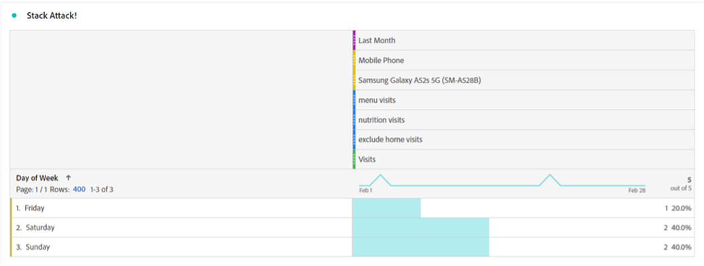
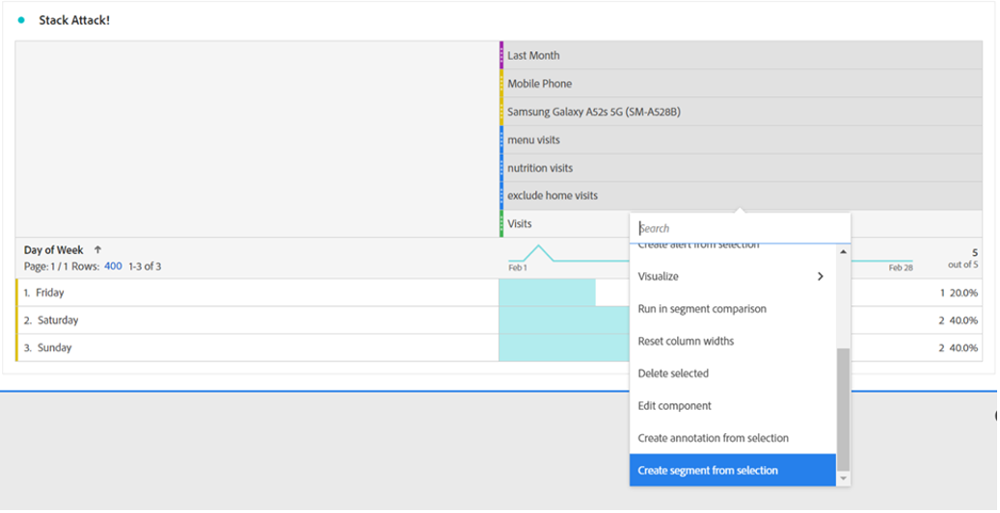

# Ora attendi un segmento. Utilizzo dei segmenti per scoprire nuove informazioni in Analysis Workspace

Che tu sia un nuovo utente di [!DNL Adobe Analytics] o un professionista esperto, sfrutterai i segmenti piuttosto bene nei tuoi progetti Analysis Workspace. Come descrive l&#39;[[!DNL Adobe] Experience League](https://experienceleague.adobe.com/docs/analytics/components/segmentation/seg-overview.html?lang=en), &quot;i segmenti ti consentono di identificare sottoinsiemi di visitatori in base a caratteristiche o interazioni con siti Web&quot;. Anche se il risultato di base di questa funzione consiste nell’isolare gruppi di utenti, visite o hit sul sito, un analista attento come te può diventare creativo con questo strumento e trovare nuovi modi per ottenere informazioni approfondite sull’attività del sito. L&#39;elenco delle opzioni possibili è molto ampio, quindi non esitare a provare a crearne una tua e a condividerla con altri nella tua organizzazione o online in community come la [[!DNL Adobe Analytics] Community](https://experienceleaguecommunities.adobe.com/t5/adobe-analytics/ct-p/adobe-analytics-community) sull&#39;Experience League o la community [#Measure Slack](https://www.measure.chat/).

Se hai bisogno di un rapido aggiornamento su come creare un segmento, consulta la documentazione di Experience League sull&#39;utilizzo di [Segment Builder](https://experienceleague.adobe.com/docs/analytics/components/segmentation/segmentation-workflow/seg-build.html?lang=en) in Analysis Workspace.

## Confronto e contrasto dei segmenti

In Analysis Workspace puoi confrontare due segmenti utilizzando &quot;[Confronto segmenti](https://experienceleague.adobe.com/docs/analytics/analyze/analysis-workspace/panels/segment-comparison/segment-comparison.html?lang=en)&quot;. Il confronto dei segmenti si trova nella sezione Pannelli della barra di navigazione a sinistra:

Tuttavia, a volte non è necessario un pannello di confronto completo per fornire informazioni chiave agli utenti finali. Fortunatamente alcune funzioni possono essere confrontate anche in un pannello standard.

La visualizzazione [Diagramma di Venn](https://experienceleague.adobe.com/docs/analytics/analyze/analysis-workspace/visualizations/venn.html?lang=en) consente di creare un confronto rapido, che consente di passare il puntatore del mouse e visualizzare le sessioni, gli ordini, gli utenti e così via sovrapposti. tra 2 e 3 segmenti personalizzati. Puoi anche creare rapidamente i segmenti facendo clic con il pulsante destro del mouse su una delle sezioni sovrapposte:

A volte le informazioni importanti non si trovano nei dati sovrapposti, ma nei dati che non si sovrappongono. Un modo rapido per visualizzarlo è creare una copia di un segmento e renderlo un segmento &quot;Escludi&quot;:

Impilando il segmento &quot;escludi&quot; con l’altro segmento nel confronto, ora puoi calcolare rapidamente quante visite hanno colpito la pagina del menu senza visualizzare anche la pagina principale nella stessa sessione:

## Attacco stack

Allo stesso modo, potete creare i dati di intersezione di un diagramma di Venn semplicemente impilando tutti i segmenti. Non esiste alcun limite al numero di segmenti o singole dimensioni sovrapposte. Per esempio, se volevo scoprire rapidamente quali Giorni della Settimana il mese scorso il mio sito ha avuto una visita su un telefono cellulare, in particolare un Samsung Galaxy A52, che ha visto il mio menu e le pagine di nutrizione, ma NON ha visto la mia home page, Posso costruirlo rapidamente al volo come questo:

Ma ancora meglio, una volta trovato quel sottoinsieme perfetto del mio utente o base di visita, posso selezionare tutti questi valori, fare clic con il pulsante destro del mouse e creare un segmento all&#39;istante:

In un segmento c&#39;è molta potenza.

## Un segmento di numeri per un numero di segmenti

Molti utenti spesso considerano i valori nominali, ordinali o di intervallo durante la creazione di segmenti, ad esempio una pagina visitata, una fascia di età degli utenti o il numero di visite effettuate da un utente in passato. Tuttavia, puoi utilizzare anche i dati del rapporto durante la creazione di un segmento raggruppando questi valori, che si tratti di dimensioni standard, metriche standard o variabili e metriche personalizzate per la tua organizzazione.

Ad esempio, Time Spent on Page (Tempo trascorso su pagina) o Time Spent per Visit (Tempo trascorso per visita) dispone di contenitori predefiniti:

Tuttavia, queste potrebbero non sempre corrispondere alle esigenze della tua organizzazione: probabilmente la maggior parte delle visite al sito non durano più di 10 minuti. Puoi utilizzare la misurazione granulare per creare contenitori di dimensioni diverse. Eccone una creata per esaminare le visite che durano tra 1 minuto, 1 secondo e 1 minuto, 30 secondi:

Una volta creato, posso ora iniziare a esaminare le mie visite, gli ordini e altri eventi in base ai diversi gruppi di tempo a blocchi che ho personalizzato:

Puoi anche iniziare a esaminare il cambiamento degli indicatori di prestazioni chiave (KPI, Key Performance Indicators) come fattore del tempo trascorso da un utente, del numero di pagine visitate in una visita, del numero di volte che ha visitato in passato o di qualsiasi altro valore numerico, che ti consente di guardare una metrica come fattore di un’altra metrica:

Le possibilità di utilizzare i segmenti per trovare nuove informazioni sono infinite. Questo è semplicemente un punto di partenza. Prova con alcune e comunica alla community cosa scopri: [[!DNL Adobe Analytics] Community](https://experienceleaguecommunities.adobe.com/t5/adobe-analytics/ct-p/adobe-analytics-community) su Experience League o la community [#Measure su Slack](https://www.measure.chat/).

Buona segmentazione!

## Autore

Questo documento è stato scritto da:

**Dan Cummings**, Sr. Direttore tecnico [!DNL Analytics] presso McDonald&#39;s Corporation

[!DNL Adobe Analytics] campione
