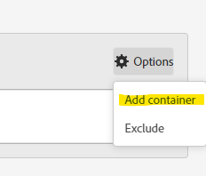
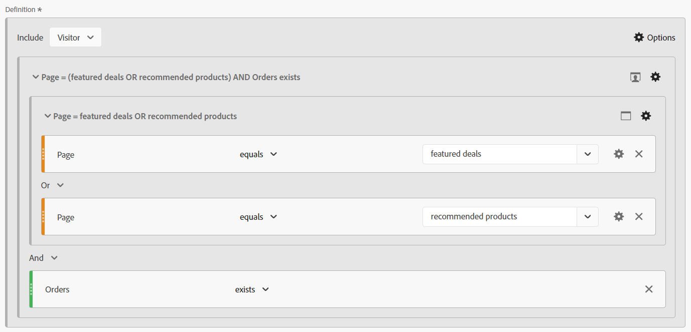
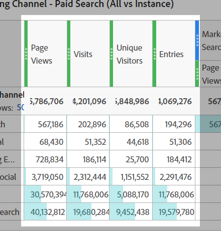
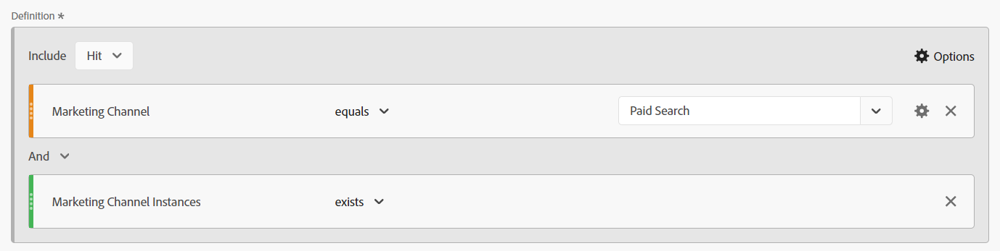
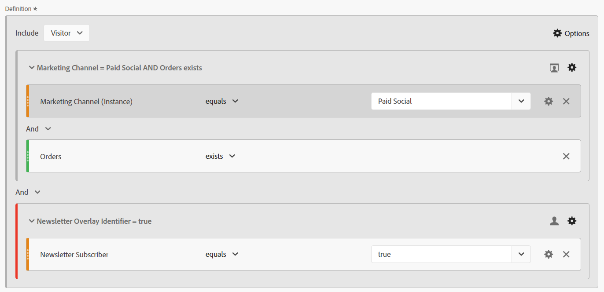

# La magia dietro il sipario: segmenti complessi: escludi, contenitori e attribuzione

_Scopri le complessità della segmentazione complessa dei dati, esplorando le esclusioni, i contenitori e i modelli di attribuzione. Come il gioco di prestigio di un mago, la padronanza di queste tecniche consente agli analisti di eseguire la magia dei dati, trasformando le informazioni con precisione e finezza._

Le tende sono aperte, il palco è impostato... questo potrebbe non essere un atto magico di Las Vegas, ma possiamo eseguire alcuni trucchi piuttosto sorprendenti durante la costruzione dei nostri segmenti.

All’interno di questo modulo verranno trattati:

- Escludi logica
- Utilizzo dei contenitori
- Modello di attribuzione

## Includi/Escludi

Per impostazione predefinita, tutti i contenitori iniziano con **include** tipo, ovvero restituiscono i dati che corrispondono ai criteri. Tuttavia, puoi anche modificare il segmento o i contenitori all’interno dei segmenti in modo che siano **escludi** , che consente di rifiutare determinati criteri.

Anche se un mago può trovare la tua carta nel mazzo, è sorprendente che possa far sì che il resto del mazzo non esista. Allo stesso modo, nei segmenti di esclusione, vogliamo che i dati indesiderati scompaiano semplicemente dal nostro set di dati.

Potreste stare lì seduti a pensare, &quot;Ok, ma ho già le opzioni &#39;Does not Equal&#39; e &#39;Does not Contain&#39;, quindi non dovrebbe coprirmi?&quot; Sfortunatamente, la risposta è no... e non si tratta solo di essere in grado di escludere gruppi di logica, su un singolo elemento. Anche quando si tratta di un singolo componente, spesso è necessario utilizzare *esclude* per raggiungere l’obiettivo.

- **Non contiene / Non è uguale a** - È proprio come suona, corrispondenza su elementi che non contengono una stringa specifica
- **Escludi: il valore contiene/è uguale a** - Questo consentirà *escludi* elementi che corrispondono alla stringa

A prima vista, entrambi suonano allo stesso modo... **hit** livelli segmenti/contenitori, saresti corretto, in quanto eseguiranno la stessa azione. Tuttavia, quando si utilizza **visita** o **visitatore** ambito otterrai risultati molto diversi.

**Figura 1: non contiene / non è uguale a - Ambito hit**

*Tieni presente che ogni hit restituisce un valore true o false e che tali valori sono invertiti tra &quot;does not&quot; e &quot;exclude&quot;.*

- Se &quot;Value&quot; non contiene &quot;Example&quot; (yes), restituisce true e include tale hit; analogamente, se &quot;Example&quot; non contiene &quot;Example&quot; (no, lo contiene), restituisce false e non include tale hit. In pratica, restituisce qualsiasi dato che restituisce un risultato vero.
- Se &quot;Value&quot; contiene &quot;Example&quot; (no), restituisce false e non esclude tale hit; analogamente, se &quot;Example&quot; contiene &quot;Example&quot; (yes), restituisce true ed esclude tale hit. In pratica, restituisci dati che non **non** ottenere un risultato vero o restituire dati falsi in base ai criteri.
- Lo puoi vedere alla **Hit** livello, entrambi i set di logica restituiranno lo stesso set di dati.

**Figura 2: non contiene / non è uguale a - Ambito della visita**

*Come sopra, ogni hit all&#39;interno del **visita**verrà valutato con lo stesso valore true/false. Tuttavia, il set di dati restituito è quello dell’intera visita.*

- In ogni hit, &quot;Value&quot; non contiene &quot;Example&quot; (yes), quindi restituisce true; allo stesso modo, &quot;Example&quot; non contiene &quot;Example&quot; (no, lo contiene), quindi restituisce false.
   - Se **qualsiasi** hit nei ritorni di visita **true**, quindi **visita intera** viene restituito.*
   - Se la visita era costituita interamente da hit contenenti &quot;Esempio&quot;, nessun hit sarebbe diventato vero, e quindi quella visita sarebbe **non essere restituito** nel set di dati.
- Anche in questo caso, a ogni hit &quot;Esempio&quot; contiene &quot;Esempio&quot; (sì), quindi restituisce true
   - Se **qualsiasi hit** restituisce **true**, l’intera visita sarà **escluso**
   - Se **tutti gli hit** nel ritorno della visita **false**, quindi la visita verrà restituita nel set di dati
- Ora potete vedere dove questa logica comincia a divergere. Nell’esempio precedente vi sono tre visite distinte:
   - Quando si utilizza &quot;Does Not Contain / Equal&quot; **due dei tre** le visite verranno restituite.
   - Quando si utilizza &quot;Escludi contiene/è uguale a&quot; **solo uno** di tali visite sarà restituita

**Figura 3: non contiene / non è uguale a - Ambito della visita**

*Come sopra, ogni hit effettuato da **visitatore**verrà valutato con la stessa logica true/false. Ma ora stiamo esaminando tutti gli hit che questo visitatore ha fatto, per tutte le visite (all’interno dell’intervallo di date selezionato).*

- In ogni hit, &quot;Value&quot; non contiene &quot;Example&quot; (yes), quindi restituisce true; allo stesso modo, &quot;Example&quot; non contiene &quot;Example&quot; (no, lo contiene), quindi restituisce false.
   - Se **qualsiasi** hit effettuato dal visitatore restituisce **true**, quindi **visita intera** viene restituito.
   - Se il visitatore non ha mai fatto un hit contenente &quot;Esempio&quot;, nessun hit restituirà true, e quindi il visitatore **non essere restituito** nel set di dati.
- Anche in questo caso, a ogni hit &quot;Esempio&quot; contiene &quot;Esempio&quot; (sì), quindi restituisce true.
   - Se **qualsiasi hit** restituisce **true**, l’intero visitatore (e successivamente tutte le sue visite) sarà **esclusi.**
   - Se **tutti gli hit** nel ritorno della visita **false**, quindi quel visitatore verrà restituito nel tuo set di dati, restituendo in tal modo con successo i visitatori che non avevano fatto &quot;X&quot;.
- Si tratta di un’estensione della logica di visita, in cui sono presenti ulteriori considerazioni. Nell’esempio precedente ci sono due visitatori distinti, con 3 visite ciascuno:
   - Quando si utilizza &quot;Does Not Contain / Equal&quot; **entrambi** i visitatori verranno restituiti, come tutti **tre** delle loro visite (per un totale di 2 visitatori e 6 visite nei rapporti)
   - Quando si utilizza &quot;Escludi contiene/è uguale a&quot; **solo uno** di questi visitatori verranno restituiti e verranno incluse solo le tre visite associate a quel visitatore (che rappresentano 1 visitatore e 3 visite totali nei rapporti)

>[!TIP]
>
>Questa logica può essere complessa, soprattutto quando inizi a nidificare i contenitori... è sempre consigliabile eseguire test sui dati di esempio controllati per garantire che il segmento restituisca effettivamente i dati che ritieni debbano essere.

### Esempio di segmento 1: escludere le visite che effettuano un acquisto

In questo esempio, voglio eseguire il targeting degli utenti che sono venuti su un sito e *non* fare un acquisto durante la loro visita (in pratica, voglio escludere le visite che hanno eseguito una transazione; quindi, sarò lasciato con le visite che non hanno completato una transazione)

Per un confronto, vediamo un segmento creato utilizzando &quot;Non esiste&quot;:

Osserva come l’anteprima mostra un risultato molto diverso... infatti, questo segmento restituirà il 100% delle mie visite, perché ogni visita ha almeno un hit che non include la metrica &quot;Ordine&quot;.

Per illustrare ulteriormente questo aspetto, confrontiamo i due segmenti uno accanto all’altro:

Primo, lo si può vedere nonostante *visita* dell’ambito del segmento, possiamo associare il segmento ad altre metriche (come visualizzazioni di pagina o visitatori univoci). Il primo set di colonne è desegmentato, per mostrare subito che l’unico segmento (inesistente) restituisce quasi il 100% dei dati; solo il segmento di esclusione esegue le operazioni che ci servono.

La colonna più evidente sono gli ordini, che dovrebbero essere immediatamente ovvi: il contenitore &quot;Non esiste&quot; è errato, poiché la maggior parte degli ordini viene ancora restituita.

### Esempio di segmento 2: escludi i visitatori che hanno effettuato un acquisto nel periodo di reporting

In questo esempio, voglio utilizzare le idee del campione precedente (che ha guardato specificamente al livello di visita) ed espanderlo per trovare i visitatori che non hanno effettuato un acquisto nell’intervallo di tempo del mio rapporto.

Questo segmento sarà molto simile all’esempio precedente, quasi identico, ma l’ambito del segmento farà una grande differenza.

Ora, se confrontiamo il segmento con ambito visitatore con il segmento con ambito visita riportato qui sopra, vedrai che sono esclusi molti più dati e molte altre visite, dal momento che *visitatori che hanno effettuato acquisti* ha avuto anche visite in cui non sono stati effettuati acquisti e quindi anche tali visite sono escluse in quanto fanno parte del ciclo di vita del visitatore.

>[!IMPORTANT]
>
>Quando cerchi dati con ambito visitatore, più si allunga l’intervallo di tempo del rapporto, maggiore sarà l’esclusione, poiché molti visitatori saranno fedeli ai visitatori di ritorno al sito (ovviamente, alcuni modelli di business vedranno un impatto più elevato di altri)

>[!IMPORTANT]
>
>Anche se le differenze tra visita e visitatore possono essere *sottile* (in particolare in questi dati di esempio), sono logiche univoche che devono essere prese in considerazione. I dati possono essere notevolmente diversi a seconda del sito e dei comportamenti degli utenti.

È importante sapere esattamente quali dati, o cosa *storia*, stai cercando di capire con il tuo report. Assicurati che le tabelle e le visualizzazioni siano chiaramente visibili al pubblico ***cosa*** viene mostrato e l’utilizzo del modello di segmento appropriato è fondamentale per effettuare un’analisi appropriata. Le decisioni informate possono essere prese correttamente solo se tutti capiscono cosa stanno guardando.

## Utilizzo dei contenitori

I contenitori consentono di creare una &quot;sublogica&quot; all’interno della logica principale del segmento. Un equivoco comune è che l’ambito deve essere lo stesso tra il segmento e il contenitore... ma non lo è. Questo ci dà più libertà di creare scenari specifici nel più grande schema delle cose, per costruire logiche complesse.

Il modo migliore per pensare ai contenitori è immaginare che ogni contenitore sia una scatola, e che possiamo impilare scatole (di logica) all&#39;interno di un&#39;altra scatola, all&#39;interno di un&#39;altra... ma a differenza delle scatole fisiche in cui ogni scatola deve essere più piccola della scatola esterna, possiamo mettere qualcosa di più grande all&#39;interno se questo ci porta a recuperare i dati corretti. Pensatela come un cappello da mago, dove l&#39;impossibile può stare dentro e noi siamo i maghi dei dati...

### Ambito dei contenitori

Cominciamo con una rapida suddivisione di *contenitore* ambito. Mi piace *segmento s* far fronte, hai le tue basi **hit**, **visita** e **visitatore** opzioni di ambito, ma a volte vedrai anche qualcosa chiamato **gruppo logico** al posto di visitatore (questo si verifica solo all’interno di segmenti sequenziali e saranno trattati nel prossimo articolo).

L’aggiunta di contenitori all’interno del segmento (o all’interno di altri contenitori) può essere ottenuta tramite l’accesso a **opzioni*** menu (quando nidifichi più elementi, fai attenzione ad aggiungere al blocco corretto, anche se fortunatamente puoi trascinare i contenitori all’interno dell’interfaccia se lo aggiungi alla posizione sbagliata)

**Figura 1: Aggiunta di un contenitore**

L’ambito di un contenitore è indipendente dall’elemento padre, come ho già detto, questi *non* devono corrispondere, e a seconda di ciò che si desidera restituire, potrebbe essere necessario disegnare il piano per visualizzare completamente ciò di cui hai bisogno, almeno fino a quando non si ottiene comodo visualizzarlo nella tua testa.

**Figura 2: Ambito del segmento e ambito del contenitore**

>[!NOTE]
>
>L’Adobe ha una logica per comprendere i segmenti validi e non validi, non fornirebbe opzioni che potrebbero *mai* funziona... quindi, se trovi l’opzione per utilizzare un contenitore con ambito visitatore all’interno di un segmento con ambito hit, significa che si tratta di un’opzione valida.

Proprio come per i segmenti di base, quando inizi a creare un segmento complesso con contenitori nidificati, devi avere un’idea chiara su ***cosa*** il tipo di dati che desideri ricevere. ***Come*** hai intenzione di utilizzare quei dati? ***Quale*** le metriche prevedono l’associazione con il segmento?

Queste domande aiuteranno a determinare quale sarà l’ambito del segmento nel suo insieme, questo è il punto di partenza per qualsiasi segmento.

Solo perché pensi di associare un segmento alla metrica dei visitatori univoci non significa che il segmento stesso debba essere a livello di visitatore... lungi dall’essere tale. Un segmento a livello di visitatore restituisce tutti i dati di un visitatore... questo significa tutte le sue visite, tutte le sue visualizzazioni di pagina, ecc... una volta che un visitatore corrisponde ai criteri del segmento, il tuo segmento potrebbe iniziare a restituire i dati dal *passato* per questo visitatore (purché sia compreso nell’intervallo di date dell’area di lavoro).

>[!IMPORTANT]
>
>Anche quando pianifichi l’associazione di un segmento con la metrica Visitatori univoci, questo *non significa* il segmento deve essere automaticamente con ambito visitatore... Questo equivoco *potrebbe* creare risultati gonfiati e non corretti.

Ho parlato molto dei concetti su come selezionare l’ambito appropriato, ma non ho fornito esempi o specifiche che ti aiuteranno davvero... quindi approfondiamo questo argomento con alcuni esempi di casi d’uso reali. Dicono che un mago non rivela mai i suoi segreti, ma non è proprio vero. All&#39;interno del mondo magico le tecniche e le lavorazioni &quot;dietro le quinte&quot; sono spesso condivise con i coetanei, consentendo loro di costruire e migliorare l&#39;illusione, e questo è ciò che intendo fare... per aprire la porta alle possibilità che vi attendono.

### Esempio di segmento 3: visualizzazioni su pagine specifiche da parte di visitatori che hanno effettuato un ordine recente (all’interno del periodo di reporting)

In questo scenario, voglio solo restituire un set di pagine specifiche che sono state visitate da acquirenti recenti (tieni presente che posso ancora associarlo a visite o visitatori univoci, anche se il segmento stesso si troverà in un ambito HIT).

Questo tipo di scenario è utile per verificare se alcuni acquirenti visualizzano pagine specifiche di un sito, pagine che potrebbero non essere collegate in modo esplicito a un evento specifico.

Nel mio esempio vedrò le pagine di &quot;Offerte consigliate&quot; e &quot;Prodotti consigliati&quot;. Attualmente, la logica sarà semplice e non verrà inserita nella segmentazione sequenziale (almeno non ancora, ma in un articolo futuro verrà trattata una logica più complessa come questa).

Un&#39;altra domanda è **perché** ci stiamo tirando indietro con degli hit? Tecnicamente potrei richiamare da Visite o Visitatori qui, ma posso anche guardare a queste pagine specifiche per **visualizzazioni di pagina (per il set di pagine specifico) per visita** o **visualizzazioni di pagina (per il set specifico) per visitatore** Questo ambito mi offre la flessibilità di eseguire questa matematica specifica. Poiché questi hit possono essere facilmente abbinati a visite o visitatori univoci per determinare il numero di visite o visitatori che visualizzano queste pagine, opterò per il segmento più flessibile che posso utilizzare per tutti gli scenari.

Innanzitutto, per un confronto, ecco un segmento semplice basato su HIT per le pagine specifiche.

Ora, prendiamo in considerazione la complessità:

Noterai che non utilizzo solo più contenitori, ma che sto mescolando l’ambito di tali contenitori. Il segmento nel suo complesso è a livello di HIT, ma sto anche cercando i VISITATORI che hanno effettuato un ordine.

Passiamo un po&#39; di tempo a svelarlo, visto che sta succedendo molto.

In primo luogo, invece di mostrare un raggruppamento giornaliero, sto mostrando un raggruppamento di pagina, perché penso che questo aiuterà a illustrare meglio i due segmenti.

<table style="border: 0;">
    <tr>
        <td width="352" style="border: 0;">Le prime tre colonne (Visualizzazioni di pagina, visite e visitatori univoci) non sono segmentate e quindi mostrano tutte le pagine all’interno del sito. Non ho incluso gli ordini qui, poiché gli ordini vengono tracciati su un'azione, e quindi non fanno parte dell'ambito della dimensione pagina.</td>
        <td style="border: 0;">&lt;img src="assets/segment-example-3/segment3c-comparison-table-detail1.png" width="352"
        </td>
    </tr>
</table>

<table style="border: 0;">
    <tr>
        <td width="352" style="border: 0;">Ora sto mostrando il risultato del segmento semplice, che considera solo <strong>hit</strong> nelle due pagine specificate. Noterai che tutte le altre pagine del raggruppamento restituiscono 0, come previsto.</td>
        <td style="border: 0;">&lt;img src="assets/segment-example-3/segment3c-comparison-table-detail2.png" width="352"
        </td>
    </tr>
</table>

<table style="border: 0;">
    <tr>
        <td width="352" style="border: 0;">Ora, ecco un piccolo suggerimento bonus, prima di mostrare il risultato del segmento avanzato, ho usato un altro semplice segmento di "Orders Exists" (a un ambito di livello HIT), e ho abbinato con visitatori unici. Questo mi restituirà il totale di UV che hanno effettuato ordini nel mio periodo di rapporto, così come i UV che hanno colpito ognuna di quelle pagine... questo aiuterà a illustrare meglio il prossimo set di colonne.</td>
        <td style="border: 0;">&lt;img src="assets/segment-example-3/segment3c-comparison-table-detail3.png" width="352"
        </td>
    </tr>
</table>

<table style="border: 0;">
    <tr>
        <td width="352" style="border: 0;">Il set finale di colonne viene impilato con il segmento complesso. Il totale di UV con ordini corrisponde al segmento semplice "Ordini esistenti" in ogni pagina, ma noterai che il totale è significativamente diverso; poiché questo set di dati limita esplicitamente il set di dati solo ai visitatori che hanno effettuato ordini E hanno raggiunto le pagine, sono esplicitamente interessato a.</td> <td style="border: 0;">
        </td>
    </tr>
</table>

### Esempio di segmento 4: visite che hanno avuto luogo con offerte in primo piano O prodotti consigliati E che hanno effettuato un ordine all’interno della stessa visita

L’esempio precedente ha mostrato come aggiungere un contenitore con ambito maggiore (ad esempio visitatore) all’interno di un contenitore con ambito più piccolo (ad esempio hit, in modo da non sorprendere che sia possibile aggiungere contenitori di hit all’interno di segmenti con ambito visitatore o visita).

Utilizzando alcune delle pagine che stavamo consultando in precedenza, ora ci preoccupiamo solo di recuperare i visitatori che sono capitati colpire le offerte in primo piano O la pagina di prodotti consigliati e ha fatto un ordine all&#39;interno della stessa visita.

Questo segmento combina tutti e tre gli ambiti. Il livello superiore del segmento è visitatore, in modo che tutti gli hit di tutte le visite vengano restituiti per il visitatore corrispondente. All’interno di, abbiamo aggiunto un contenitore ambito visita per garantire che il visitatore abbia avuto almeno una visita corrispondente ai criteri specifici per effettuare un ordine E aver visitato pagine specifiche. È stato aggiunto un contenitore ambito hit per le pagine stesse, in modo da poter utilizzare la logica OR per cercare la pagina delle offerte in primo piano O la pagina dei prodotti consigliati.

Il vantaggio per questo segmento con ambito visitatore è che questo restituirà **TUTTI** visite da parte dei visitatori che corrispondono a questo criterio, quindi questo segmento sarà utile se voglio vedere i comportamenti delle visite precedenti che hanno portato a questa combinazione e le azioni di questi visitatori dopo uno scenario del genere.

Qui sto confrontando gli hit su offerte in primo piano/contenuti consigliati, agli ordini esistenti, al segmento complesso in cui sia l’ordine che una delle pagine specificate esistono nella stessa visita. Il segmento complesso è quello in cui i primi due segmenti si intersecano; ma poiché il suo ambito visitatore, verranno restituite anche tutte le altre visite per tali visitatori.

## Modello di attribuzione

La modellazione dell’attribuzione all’interno di una definizione di segmento si riferisce principalmente a dimensioni che non hanno una scadenza hit, pertanto le proprietà (che sono sempre a livello di hit) non sono un buon candidato. Le eVar, i canali di marketing, ecc. tuttavia, sono realmente ciò per cui queste impostazioni sono progettati.

Prima di esaminare il segmento, è necessario rivedere rapidamente il funzionamento della modellazione di attribuzione in un semplice esempio.

Supponiamo di avere due eVar, una delle quali è impostata per la scadenza (eVar1) e una per la scadenza di 30 giorni (eVar2). Per semplicità, stiamo per tenere traccia di una campagna interna (icid).

**Visita 1**

- Pagina A
   - **EVAR 1** non è impostato
   - **EVAR 2** non è impostato
- Fai clic sul banner promozionale con ?icid=promo-banner nell’URL
- Pagina B
   - **EVAR 1** e **EVAR 2** sono impostati su &quot;promo-banner&quot;
   - **Istanza di eVar1** è attivato
   - **Istanza di eVar2** è attivato
- Pagina C
   - Entrambi **EVAR 1** e **EVAR 2** mantieni il valore &quot;promo-banner&quot;
   - Nessuna delle metriche di istanza per le eVar viene attivata, in quanto entrambe le eVar utilizzano valori persistenti

**Visita 2**

- Pagina D
   - **EVAR 1** non è impostato su alcun valore e no **Istanza di eVar1** è attivato
   - **EVAR 2** mantiene il valore &quot;promo-banner&quot; a causa della scadenza di 30 giorni
   - **Istanza di eVar2** non viene attivato, perché il valore è persistente e non è effettivamente impostato
- Fai clic sulla promozione Side Rail con ?icid=promo-side-rail in the URL
- Pagina E
   - **EVAR 1** e **EVAR 2** sono impostati su &quot;promo-side-rail&quot;
   - **Istanza di eVar1** è attivato
   - **Istanza di eVar2** è attivato
- Pagina F
   - Entrambi **EVAR 1** e **EVAR 2** mantieni il valore &quot;promo-side-rail&quot;
   - Nessuna delle metriche di istanza per le eVar viene attivata, in quanto entrambe le eVar utilizzano valori persistenti

Attualmente, il risultato atteso di queste due visite è il seguente:

<table><tr><th colspan="1" valign="top"></th><th colspan="1" valign="top"></th><th colspan="1" valign="top"><b>Page Views</b></th><th colspan="1" valign="top"><b>Visite</b></th><th colspan="1" valign="top"><b>Istanza di eVar1</b></th><th colspan="1" valign="top"><b>Istanza di eVar2</b></th></tr>
<tr><td colspan="1" valign="top"></td><td colspan="1" valign="top"></td><td colspan="1" valign="top">6</td><td colspan="1" valign="top">2</td><td colspan="1" valign="top">2</td><td colspan="1" valign="top">2</td></tr>
<tr><td colspan="1" rowspan="7" valign="top">Pagina</td><td colspan="1" valign="top"></td><td colspan="1" valign="top">6</td><td colspan="1" valign="top">2</td><td colspan="1" valign="top">2</td><td colspan="1" valign="top">2</td></tr>
<tr><td colspan="1" valign="top">Pagina A</td><td colspan="1" valign="top">1</td><td colspan="1" valign="top">1</td><td colspan="1" valign="top">0</td><td colspan="1" valign="top">0</td></tr>
<tr><td colspan="1" valign="top">Pagina B</td><td colspan="1" valign="top">1</td><td colspan="1" valign="top">1</td><td colspan="1" valign="top">1</td><td colspan="1" valign="top">1</td></tr>
<tr><td colspan="1" valign="top">Pagina C</td><td colspan="1" valign="top">1</td><td colspan="1" valign="top">1</td><td colspan="1" valign="top">0</td><td colspan="1" valign="top">0</td></tr>
<tr><td colspan="1" valign="top">Pagina D</td><td colspan="1" valign="top">1</td><td colspan="1" valign="top">1</td><td colspan="1" valign="top">0</td><td colspan="1" valign="top">0</td></tr>
<tr><td colspan="1" valign="top">Pagina E</td><td colspan="1" valign="top">1</td><td colspan="1" valign="top">1</td><td colspan="1" valign="top">1</td><td colspan="1" valign="top">1</td></tr>
<tr><td colspan="1" valign="top">Pagina F</td><td colspan="1" valign="top">1</td><td colspan="1" valign="top">1</td><td colspan="1" valign="top">0</td><td colspan="1" valign="top">0</td></tr>
</table>

<table><tr><th colspan="1" valign="top"></th><th colspan="1" valign="top"></th><th colspan="1" valign="top"><b>Page Views</b></th><th colspan="1" valign="top"><b>Visite</b></th><th colspan="1" valign="top"><b>Istanza di eVar1</b></th></tr>
<tr><td colspan="1" valign="top"></td><td colspan="1" valign="top"></td><td colspan="1" valign="top">4</td><td colspan="1" valign="top">2</td><td colspan="1" valign="top">2</td></tr>
<tr><td colspan="1" rowspan="3" valign="top">EVAR 1</td><td colspan="1" valign="top"></td><td colspan="1" valign="top">4</td><td colspan="1" valign="top">2</td><td colspan="1" valign="top">2</td></tr>
<tr><td colspan="1" valign="top">banner promozionale</td><td colspan="1" valign="top">2</td><td colspan="1" valign="top">1</td><td colspan="1" valign="top">1</td></tr>
<tr><td colspan="1" valign="top">promo-side-rail</td><td colspan="1" valign="top">2</td><td colspan="1" valign="top">1</td><td colspan="1" valign="top">1</td></tr>
</table>

<table><tr><th colspan="1" valign="top"></th><th colspan="1" valign="top"></th><th colspan="1" valign="top"><b>Page Views</b></th><th colspan="1" valign="top"><b>Visite</b></th><th colspan="1" valign="top"><b>Istanza di eVar2</b></th></tr>
<tr><td colspan="1" valign="top"></td><td colspan="1" valign="top"></td><td colspan="1" valign="top">5</td><td colspan="1" valign="top">2</td><td colspan="1" valign="top">2</td></tr>
<tr><td colspan="1" rowspan="3" valign="top">EVAR 2</td><td colspan="1" valign="top"></td><td colspan="1" valign="top">5</td><td colspan="1" valign="top">2</td><td colspan="1" valign="top">2</td></tr>
<tr><td colspan="1" valign="top">banner promozionale</td><td colspan="1" valign="top">3</td><td colspan="1" valign="top">2</td><td colspan="1" valign="top">1</td></tr>
<tr><td colspan="1" valign="top">promo-side-rail</td><td colspan="1" valign="top">2</td><td colspan="1" valign="top">1</td><td colspan="1" valign="top">1</td></tr>
</table>

Ora vediamo dove puoi impostare l’attribuzione nel segmento.

**Figura 4: modello di attribuzione**

*L’icona a forma di ingranaggio nella dimensione è il punto in cui puoi impostare l’attribuzione. Ogni opzione include informazioni disponibili quando si passa il puntatore del mouse su &quot;?&quot; icona. Fondamentalmente:*

- Il comportamento predefinito restituisce tutte le istanze dell’eVar in cui è impostato il valore (in modo specifico o tramite l’attribuzione set)
- L’istanza restituirà solo la dimensione in cui il valore è impostato esplicitamente (ovvero sugli hit in cui viene attivata l’istanza di eVar)
- L’istanza non ripetuta restituirà solo la prima volta che viene impostato il valore della dimensione (ad esempio, anche se non trattata nell’esempio precedente, immagina che l’utente abbia fatto clic più volte sul banner promozionale, questo incrementerà anche l’istanza di eVar per ogni volta che si fa clic sul banner, questa impostazione prenderà solo la prima istanza univoca di &quot;promo-banner&quot; e ignorerà eventuali conteggi successivi di questo banner)

### Esempio di segmento 5: canale di marketing &quot;Paid Search&quot; (Ricerca a pagamento) rispetto alle istanze dirette di ricerca a pagamento

Come tutti sappiamo, i canali di marketing hanno un modello di attribuzione lungo (30 giorni per impostazione predefinita, ma che potrebbe essere personalizzato in base alle tue esigenze) e una volta impostato, il canale di marketing non verrà sovrascritto da successive visite &quot;dirette&quot; al sito, in modo che i driver specifici ottengano l’attribuzione di conversione. Tuttavia, a volte è necessario vedere in modo specifico ***voci*** nel tuo sito da uno specifico canale di marketing; e per voci, intendo che devi vedere quando il canale di marketing è impostato in modo specifico in base alle tue regole di elaborazione di marketing.

Iniziamo con il cambiare le cose guardando i confronti, poi approfondiamo i segmenti.

<table style="border: 0;">
    <tr>
        <td width="352" style="border: 0;">Le prime 4 colonne non sono segmentate e devono essere di facile comprensione. Tieni presente che *"Voci"* è fondamentalmente un valore calcolato in base al punto in cui i visitatori iniziano la sessione. L’ho aggiunto qui per mostrare che questo non restituisce le informazioni che stiamo cercando, poiché gli utenti possono accedere al sito tramite più canali di marketing (attraverso l’osservazione dei social media, l’esecuzione di ricerche, il clic sulle e-mail di marketing, ecc.). tutto all’interno della stessa visita/sessione).</td> <td style="border: 0;">
        </td>
    </tr>
</table>

<table style="border: 0;">
    <tr>
        <td width="352" style="border: 0;">Il prossimo set di colonne utilizza un "Segmento hit standard", che esamina fondamentalmente gli hit in cui il canale di marketing è la "ricerca a pagamento". Tuttavia, questo restituirà TUTTI gli hit in base all’attribuzione Marketing Channel, non isolerà i click-through effettivi di "Ricerca a pagamento". Pertanto, questo non restituirà i dati di cui abbiamo bisogno.</td> <td style="border: 0;">
        </td>
    </tr>
</table>

<table style="border: 0;">
    <tr>
        <td width="352" style="border: 0;">Ora, i due gruppi di dati successivi sembrano identici, e infatti, questi restituiranno gli stessi dati in due modi diversi. Ma ora sto specificamente guardando il <i>istanze</i> dove si trovava il canale di marketing <strong>set</strong> a "Paid Search" (Ricerca a pagamento).</td> <td style="border: 0;">
        </td>
    </tr>
</table>

Ciò può essere fatto in due modi:

In primo luogo, si utilizza l’attribuzione della dimensione &quot;standard&quot; e questa viene associata alla metrica specifica &quot;Istanza canale di marketing&quot; (come *esiste* (logica):

In secondo luogo, per un segmento più semplice, puoi modificare l’attribuzione in &quot;Istanza&quot;. Tieni presente che il nome della dimensione cambierà da &quot;Canale di marketing&quot; a &quot;Canale di marketing (istanza)&quot;.

## Tutti gli elementi insieme

Come ogni buon mago, possiamo iniziare con ogni singolo trucco, costruendo il pubblico mentre andiamo, portandolo al &quot;prestigio&quot; finale. Qui è dove brilliamo davvero, prendendo tutti i piccoli trucchi, e li arrotoliamo in un gran finale. Prendere le parti apparentemente sconnesse del trucco, e mostrare che in realtà, lavorano tutti insieme per formare un tutto coeso.

### Esempio di segmento 6: visitatori che hanno effettuato un ordine durante una visita con un’istanza social a pagamento ed esclusi i visitatori iscritti a una newsletter

Questo mi consentirà di identificare i visitatori che hanno effettuato attivamente un acquisto durante una visita da una campagna social media ma che non si sono iscritti alle nostre newsletter. Questo consentirà al nostro team di marketing di vedere il potenziale gruppo di utenti che tenteranno di convertire newsletter ed e-mail di marketing.

## Finale

Ci sono così tanti modi per combinare la logica e ottenere in scenari molto dettagliati, che posso solo grattare la superficie delle possibilità.

Come ogni grande mago, il vero potere è nell&#39;ispirare la generazione futura a costruire sulle basi, a reimmaginare le scoperte in qualcosa di nuovo e meraviglioso! Non vedo l&#39;ora di vedere cosa ne pensate tutti!

## Autore

Questo documento è stato scritto da:

Jennifer Dugan, Optimization Manager Analytics presso Torstar

Adobe Analytics Champion

