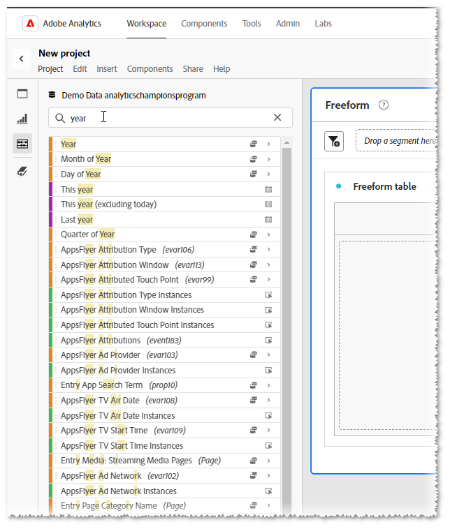

# Tag: il tuo assistente personale

_Scopri come #TAGS semplificare l&#39;analisi digitale, fungendo da assistente personale per trovare in modo efficiente ciò di cui hai bisogno. Jeff Bloomer, Adobe Analytics Champion, condivide con esperti approfondimenti sull&#39;ottimizzazione del potenziale dello strumento a tuo vantaggio._

Tutti si ricordano di aver giocato un buon gioco di tagging o anche di nascondersi e cercarsi, quando eravamo bambini, giusto?

La parte migliore è stata quando siamo stati quelli che sono tornati alla base (tag) o sono rimasti nascosti più a lungo (nascondere e cercare) fino a quando abbiamo sentito qualcuno urlare, &quot;Olly Olly buoi liberi!&quot; (&quot;Tutti voi tutti in libertà&quot;, derivava dal tedesco: &quot;alle alle auch sind frei!&quot;).  Il che alla fine significava che tutti gli altri erano riusciti a basarsi, o che qualcuno era stato etichettato &quot;it&quot;, e noi eravamo ancora liberi di giocare un altro round!

La parte importante è se il gioco è stato tag o nascondere e cercare, stavamo giocando un&#39;attività divertente in cui tutti sono stati trovati più e più volte.

Quando ci rivolgiamo al nostro lavoro quotidiano, la ricerca delle cose sembra diventare molto meno avventurosa e molto più noiosa. Ma non deve essere così se siamo disposti a mettere un po&#39; di lavoro sul fronte.  Una frase molto nota alla mia famiglia è, &quot;La maggior parte del dolore è auto-inflitto.&quot; Tuttavia, anche se può sembrare un po&#39; antiquato in questi giorni, c&#39;è una frase più famosa che è anche molto rilevante in questa situazione: &quot;Un punto nel tempo salva nove.&quot; - Benjamin Franklin

Ora che ho la vostra attenzione, permettetemi di iniziare ponendo una domanda:

Quanti di voi hanno fatto questo?  Hai iniziato a cercare una **dimensione**, un **intervallo di date**, un **segmento** o una **metrica calcolata**. Questo elenco gigante ti riempirà (vedi **Figura 1**) di tutto ciò che NON desideri.  ***Analysis Workspace*** ritiene che stia cercando di essere utile, ma in realtà è riuscito solo a non essere affatto utile.

*Figura 1 - Cerca &quot;anno&quot;*

Inoltre, hai creato alcuni *nuovi* **intervalli di date** e **segmenti** e, poiché sono &quot;così nuovi&quot;, potresti pensare che almeno questi elementi dovrebbero essere rapidi e facili da trovare la prossima volta che entri in ***Adobe Workspace***. Ho ragione?

Beh, odio far scoppiare la bolla, ma prova a lasciare ***Adobe Analytics*** dopo aver appena creato tutti i tuoi nuovi &quot;amici&quot; e quando torni, la maggior parte di loro è semplicemente scappata.  Se sei fortunato, *forse* uno di loro è rimasto indietro ad aspettarti, ma il resto è già lontano e giocare a nascondino.

## Riscrittura del registro regole

Quindi, questo è stato il gioco fin dal primo giorno, ma cosa succederebbe se potessimo cambiare le regole?

E se potessimo creare il nostro assistente personale per cambiare queste regole una volta per tutte?

Sul serio, stiamo parlando di TAGS!  Esatto!!  È il nostro amico l&#39;hashtag, precedentemente noto come &quot;numero&quot; e &quot;cancelletto&quot;, proprio come l&#39;abbiamo visto al telefono.  Quelli di noi musicisti la chiamano persino &quot;tagliente&quot;.

Per chi di voi ha *bisogno di un promemoria*, è simile al seguente: **#**

In ogni caso, il motivo per cui stiamo parlando di **#tags** è che vengono incastrati in quel &quot;secchio opzionale&quot; di &quot;roba noiosa e noiosa, maliziosa&quot; che tutti tendono a ignorare (come Descrizioni), perché siamo tutti così in fretta di creare cose più importanti come, oh non so -

- Rapporti Workspace
- Segmenti
- Metriche calcolate
- Intervalli di date

Ammettetelo, gente!  Diteci il nome, abbiamo visto e sentito tutte le scuse per cui vengono saltate:

&quot;Oh, ehi, ma è facile.  Posso sempre tornare più tardi e aggiornare quelle cose in un paio di pause pranzo, o forse anche mentre sono seduto a una conferenza e *ottenere tutto catturato*,&quot; ha detto tutti che MAI HA FATTO.

## Contenuto della casella degli strumenti

**L&#39;Adobe** ha persino reso a WE THE PEOPLE il servizio di creare un insieme selezionato di #TAGS pronti all&#39;uso, perché, beh... hanno dovuto farci partire da qualche parte.  Vi fornirò alcune avvertenze aggiuntive in appena un po&#39;, ma ciò che sto dimostrando prima vi darà il più grande colpo per il vostro dollaro!

Prima di creare un tag personalizzato, è necessario sapere come cercare i **tag** esistenti:

Che tu sia in un progetto nuovo o esistente, tutto ciò che ti serve è andare alla barra di ricerca del componente, digitare un #hashtag, insieme a uno di questi termini principali (solo guardare il video), e premere INVIO; oppure, è sufficiente iniziare lo scorrimento fino a trovare un termine riconoscibile.

ATTENZIONE: se all&#39;inizio della creazione di *propri* tag rimani fedele alle convenzioni di denominazione corrette, ogni *tag con maiuscole* visualizzato *dovrebbe* sarà usato con cautela la parola &quot;dovrebbe&quot;, che è un **Adobe**, elemento con tag predefinito.  Ciò significa che assicurati che tutti i tag creati siano in **minuscolo**.

## Creazione di un assistente personale

Ora, torniamo a quello che ho detto prima riguardo a un &quot;assistente personale&quot;.  E se vi dicessi, che potreste iniziare a selezionare alcuni dei vostri componenti preferiti esistenti e renderli gli UNICI che vedete?

1. Se si inizia a selezionare più componenti (CTRL+CLIC SINISTRO), alcune icone vengono visualizzate in alto.  Una di queste sarà l’icona TAG.
1. Fai clic su di esso, quindi viene visualizzata la finestra di dialogo TAG, in cui puoi visualizzare eventuali tag esistenti associati a tali componenti.
1. È da questa schermata che puoi assegnare i **tag aggiuntivi/nuovi** che desideri a questo punto.  (Esempio: **test\_v1**)
1. Per aggiungere un nuovo tag a un componente, premi **INVIO** prima di fare clic sul pulsante SALVA.
1. Quindi, dopo aver assegnato il nuovo TAG, puoi cercarlo inserendo l’hashtag(#) e il nuovo TAG.

Perdonate il gioco di parole, ma &quot;#tag, ci siete!&quot;  Hai appena risparmiato molto meno alla ricerca di un futuro!  Ora puoi vedere dove entreranno in gioco la tua dovuta diligenza e il tuo duro lavoro.

## Mettere al lavoro l&#39;assistente personale

Supponiamo di lavorare nel **settore viaggi** e di dover preparare un rapporto per il relativo **orario di lavoro principale**.  Se iniziassimo a fare una ricerca solo sul termine &quot;VIAGGIO&quot;, potremmo ottenere molti più risultati di quanto avremmo bisogno.  Infatti, se abbiamo appena estratto un **Workspace** contenente anche la metà dei risultati necessari, i componenti non sarebbero ancora disponibili.

Tuttavia, se per tutto il giorno lavoriamo regolarmente assegnando tag ai nostri **segmenti**, **metriche** e ad altri **componenti** rilevanti, e magari crearne solo alcuni nuovi al momento della creazione della nostra nuova **area di lavoro**, abbiamo seriamente dimostrato come possiamo riscrivere il libro delle regole a nostro favore!

In questo caso, ho creato una semplice #tag per tutti questi elementi denominata: #core.

Continuando a fare questa parte delle tue abitudini di lavoro e migliorare le tue abilità per farlo ancora e ancora, ti renderai conto che usare #tags diventerà più simile ad avere il tuo assistente personale.

Vuoi altri esempi nel mondo reale? Considera questi:

1. Ad esempio, che ne dici di trovare facilmente i tuoi **segmenti** e i tuoi **intervalli di date** per **tutti i trimestri** in **2023**?

   

   *Suggerimento aggiuntivo*: quel quadratino a destra ti consentirà persino di cambiare l&#39;ordine ordinato in *alfabetico*!

1. Naturalmente, tutti utilizzano **codici di tracciamento campagna** in una certa misura.  Se vuoi avere una visione chiara solo dei *tuoi* giocattoli, puoi aggiungere **#tag** s ai soli elementi principali necessari per visualizzare e filtrare tutti gli altri rumori:

## Ora esci e gioca!

Certo, nasconderci e cercarci è stato divertente da bambini, ma ora siamo adulti.  Non abbiamo tempo per essere costantemente alla ricerca di cose importanti, quindi assicurati di fare un favore e non perdere altro tempo a combattere lo strumento.  Riscrivi le regole e fai in modo che lo strumento funzioni al tuo posto.

### Tag, sei tu!

## Autore

Questo documento è stato scritto da:

**Jeff Bloomer**, Manager, Digital Analytics presso Kroger Personal Finance

Adobe Analytics Champion
