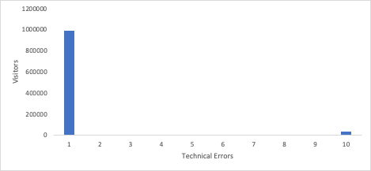

# Sblocco di approfondimenti con istogrammi: oltre le medie in [!DNL Analytics]

_Scopri l&#39;impatto degli istogrammi nelle analisi per informazioni che vanno oltre le medie. Gli istogrammi rivelano pattern di dati nel comportamento del cliente, nel coinvolgimento dei visitatori, nelle prestazioni tecniche e negli errori di modulo, consentendo approfondimenti più approfonditi e decisioni informate in [!DNL Adobe] Workspace._

Saltiamo subito dentro. Dovresti usare [istogrammi](https://experienceleague.adobe.com/docs/analytics/analyze/analysis-workspace/visualizations/histogram.html). Vi spiegherò perché, ma voglio rispondere alla vostra prima domanda: Cosa diavolo è un istogramma? Capisco. Nella maggior parte dei casi, quando vedete un mucchio di barre salire, potreste pensare che sia un grafico a barre. Sì, gli istogrammi sembrano simili, ma vi assicuro che sono diversi. Un grafico a barre confronta gli elementi, mentre un istogramma mostra la frequenza con cui si è verificata una variabile. Dai un&#39;occhiata. Ecco un grafico a barre:

Abbiamo sei modelli, e possiamo confrontare il ricavo per ogni modello. Vediamo che il modello di Johannesburg ha più entrate, mentre Berlino ha meno.

Ora vediamo un istogramma:

Nella parte inferiore dell&#39;asse x viene indicato il numero di unità acquistate da ciascun cliente. La prima barra indica la frequenza con cui un cliente ha acquistato un&#39;unità, la seconda mostra quanti clienti hanno acquistato due unità e così via, fino a clienti che hanno acquistato dieci o più unità.

Quindi, quanto è utile? Beh, vediamo che la maggior parte della gente compra solo un&#39;unità. Continua a diminuire fino a raggiungere le cinque unità. Poi declina di nuovo fino ad arrivare a dieci unità. Questo indica che ai clienti piace davvero acquistare in multipli di cinque, e forse dovremmo offrire prezzi o pacchetti speciali per trarne vantaggio. Ma di sicuro ci sono anche molti altri usi.

## Informazioni sul coinvolgimento dei visitatori

Se il sito o l’app si basa sul traffico ripetuto, vuoi sapere quanti visitatori ritornano e con quale frequenza. Uno degli istogrammi più semplici che puoi usare è scoprire quanti visitatori stanno ritornando più di una volta. Tenendo traccia dell&#39;istogramma nel tempo, potete vedere i vostri progressi, sperando che le barre a destra diventino più alte e quelle a sinistra più corte.

Forse vuoi tenere la gente sul sito, a leggere articoli. Un istogramma che mostra quanti visitatori leggono numeri diversi di articoli fornisce informazioni sul livello di coinvolgimento. Perché è utile? Supponiamo che la maggior parte dei visitatori legga un articolo e se ne vada, ma alcuni visitatori altamente coinvolti leggono tre articoli e se ne vanno. È un&#39;ottima informazione! Ora sai che devi personalizzare la pagina sul primo e sul terzo articolo letti con l’obiettivo di far sì che i visitatori leggano un altro articolo.

## Comprensione del comportamento del cliente

Il proprietario del prodotto per la documentazione dei pazienti in un sistema ospedaliero mi ha chiesto alcuni dati. C&#39;erano sei regioni tra cui scegliere per avere le tue cartelle cliniche. Voleva sapere quante persone cliccavano su più di uno. Ho creato un istogramma che mostrava quanti visitatori facevano clic sulle opzioni 1, 2, 3, 4, 5 o 6. Potrebbe sembrare eccessivo, ma più della metà dei visitatori faceva clic su almeno due opzioni e un 3,2% pieno dei visitatori faceva clic su tutte e sei. Con quell&#39;istogramma di fronte a lei, è saltata in azione, ha riorganizzato la sua roadmap e ha semplificato le opzioni fino a due. Questo ha reso l&#39;esperienza del paziente molto più semplice.

## Informazioni sulle prestazioni tecniche

Se imposti un istogramma che mostra quanti visitatori riscontrano quanti errori tecnici, potrai comprendere a fondo le prestazioni tecniche del sito. Molti visitatori che riscontrano molti errori tecnici sono un segnale per iniziare a dare priorità a tali correzioni tecniche.

## Informazioni sulle prestazioni dei moduli

I messaggi di errore in un modulo sono un argomento diverso. Si tratta di errori del visitatore, non di errori da parte tua. Tuttavia, puoi trarre vantaggio da un istogramma che mostra quanti visitatori riscontrano quanti errori. Se visualizzi un istogramma che indica che molti visitatori riscontrano molti errori, la colpa potrebbe non essere loro. Ciò potrebbe indicare che nel modulo sono presenti campi con nomi non corretti, istruzioni non chiare o una progettazione che nasconde i campi obbligatori.

## Perché non una metrica calcolata?

Potreste chiedervi, quali sono le differenze rispetto al semplice fatto di avere una metrica calcolata? Ehi, mi piace una buona metrica calcolata. Penso che siano strumenti assolutamente essenziali per comprendere le prestazioni del tuo sito. Il problema per molti dei casi d&#39;uso che ho elencato, tuttavia, è che una media può mostrare la dimensione del problema ma oscurarne la portata. Passiamo ora a descrivere come gli istogrammi forniscono informazioni aggiuntive per alcuni dei casi d’uso riportati sopra:

- Coinvolgimento dei visitatori: se hai un numero medio di storie lette pari a 1.2, personalizzare il primo articolo è piuttosto evidente. Vi perderete il fatto che c&#39;è un altro grande gruppo che esce dopo aver letto il terzo articolo, che è ciò che l&#39;istogramma rende ovvio.

  

- Errori tecnici: se hai visualizzato una media di 8,7 errori per visitatore, sapresti di aver riscontrato un problema. L’istogramma potrebbe mostrare che il 97% dei visitatori presenta uno o più errori, ma alcuni valori anomali fanno salire la media. Potreste decidere che non vale la pena dedicare molto tempo a migliorare l&#39;esperienza di quel piccolo gruppo di anomalie.

  

- Errori modulo: se hai una media di 3,6 messaggi di errore modulo per visitatore, questo è un indicatore di un problema. Potreste avere lo stesso problema di anomalia degli errori tecnici, ma c&#39;è anche da guadagnare vedendo un picco nell&#39;istogramma per un particolare numero di errori. Un picco enorme per un errore? Potrebbe trattarsi di un problema comune che interessa tutti i visitatori, oppure potrebbe trattarsi di un errore riscontrato da tutti i visitatori una volta. Un picco gigantesco con tre errori? Ah, ora è interessante. Se questo richiede un&#39;indagine che mostra che si tratta degli stessi tre errori, hai effettuato l&#39;azzeramento dei dati che ti forniscono una comprensione dei visitatori e ti aiuta a risolvere quello che probabilmente è un gruppo di problemi correlati.

  

Come potete vedere, gli istogrammi non solo hanno i loro usi, ma approfondiscono anche l&#39;intuizione che si ottiene da una media. Si tratta di una visualizzazione predefinita in [!DNL Adobe Analytics] e facile da creare. Speriamo che questi casi d’uso siano utili per te o suscitino un po’ di ispirazione. Visualizzazione felice!

## Autore

Questo documento è stato scritto da:

**Gitai Ben-Ammi**, Principal Consultant di Concentrix Catalyst

[!DNL Adobe Analytics] campione
