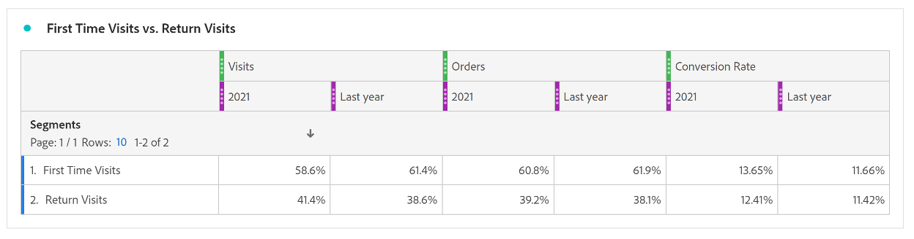

# Utilizzare l’analisi di coorte per comprendere il comportamento cliente

Per migliorare la customer experience e i ricavi, le aziende devono comprendere il comportamento dei clienti. L’analisi per coorte può aiutare a comprendere il coinvolgimento e la fidelizzazione, conducendo ad azioni come il miglioramento della creazione di account e la creazione di campagne per mesi di grandi volumi di dati.

L’analisi delle prestazioni digitali è fondamentale per comprendere in che modo i clienti interagiscono con un’azienda e quali azioni possono essere intraprese per migliorare la loro esperienza. In questo post di blog scopriremo come utilizzare l’analisi per coorte per comprendere meglio il comportamento dei clienti.

## Parte 1: Confronto delle prestazioni digitali tra la prima e la seconda visita

### Impostazione della fase

Un cliente vuole comprendere le prestazioni digitali degli ultimi 2 anni e sta considerando lo sviluppo di un programma fedeltà per promuovere le prestazioni digitali. Per iniziare, possiamo osservare il mix di siti attuale tra utenti nuovi e utenti ripetuti per capire come si comportano oggi i due gruppi di visitatori.

Prestazioni digitali correnti

1. Nel 2022, il 62% degli ordini proveniva da prime visite rispetto al 38% degli ordini provenienti da visite di ritorno (soggette a cookie, dispositivi multipli).
1. Le visite per la prima volta si convertono a un tasso leggermente superiore rispetto alle visite di ritorno per entrambi, 11,6% vs. 11,4%.
1. Rispetto al 2021, i tassi di conversione sono diminuiti in entrambi i segmenti.

## Parte 2: Analisi per coorte - Visite Disposizioni commestibili Prod globale

Per comprendere la fedeltà del canale digitale e l’opportunità di stimolare gli acquirenti ripetuti, la prossima domanda a cui rispondere è: Qual è il volume di visitatori che ritornano al sito ogni mese nel 2022?

### Introduzione all’analisi per coorte

L’analisi per coorte è uno strumento utile per comprendere il modo in cui le coorti interagiscono con un marchio nel tempo. Per iniziare, abbiamo determinato quali domande rispondere:

1. Qual è il periodo di conservazione medio per mese in un determinato anno?
1. Quale volume di visitatori del sito ritorna ogni mese in un dato anno?
1. Qual è l&#39;impatto degli accessi sulla conservazione?
1. Esistono prodotti specifici che hanno determinato una maggiore fidelizzazione?

Impostare la tabella coorte

1. Imposta l’intervallo di date da gennaio a dicembre 2022
1. **Criteri di inclusione:** Visite
1. **Criteri di ritorno:** Visite
1. **Granularità:** Mese
1. **Impostazioni:** Calcolo continuo \*\*Consente di calcolare il livello di mantenimento in base alla colonna precedente, non alla colonna inclusa. Ciò significa che un utente è incluso in ciascuno dei mesi\*\*
1. **Segmenti:** puoi selezionare segmenti specifici per sviluppare ulteriormente questa analisi
   1. Pagine di destinazione specifiche
   1. Device Type
   1. Canali di marketing
   1. Ecc.

### Interpretazione dei risultati

**Nel 2022:**

1) I mesi con i tassi di mantenimento più elevati +1 mese includono gennaio, aprile e novembre
1) I mesi con il maggior volume includono febbraio e maggio
1) Ci sono circa 1.000 visitatori che ritornano al sito ogni mese

**Nel 2021:**

1) I mesi con i tassi di mantenimento più elevati +1 mese includono aprile, gennaio e marzo
1) I mesi con il maggior volume includono febbraio e maggio

**Elementi azione:**

Crea un segmento basato sui circa 1.000 visitatori e scopri di più su di essi:

- Dove si trovano?
- Quali prodotti acquistano durante l&#39;anno?
- Da quali negozi acquistano?

I mesi chiave evidenziano l&#39;opportunità di promuovere la conservazione in base al volume:

- Esistono tattiche specifiche che possono incrementare la fedeltà durante i mesi di febbraio e maggio per sfruttare i vantaggi offerti dal volume?

Analisi ripetuta per gli ordini per comprendere gli acquirenti ripetuti

- I tassi di conservazione più elevati sono pari a +1 mese per gli stessi mesi?
- I mesi più alti di visite sono gli stessi per gli ordini?

## Parte 3: aggiunta di due metriche ai criteri di inclusione

### Comprensione dell’impatto dell’accesso

Poiché questo cliente sta cercando di comprendere il valore di un programma fedeltà, il passaggio successivo nell’analisi includeva l’aggiunta all’evento di successo Accesso come metrica di inclusione alla coorte.

Avvertenza: l’analisi per coorte non può essere utilizzata per metriche calcolate (come Tasso di conversione) o non intere (come Ricavi). Solo le metriche utilizzabili nei segmenti possono essere utilizzate nell’analisi per coorte e possono essere incrementate solo di >1 alla volta.

Il sito ha maggiori probabilità di mantenere gli utenti che effettuano l’accesso?

Quale sarebbe l’impatto se potessimo ottenere l’accesso di più utenti? È un&#39;esperienza più appiccicosa?

### Impostazione della tabella coorte

1. **Imposta intervallo date:** da gennaio a dicembre 2022
1. **Criteri di inclusione:** Visite + Evento di successo accesso
1. **Criteri di ritorno:** Visite
1. **Granularità:** Mese
1. **Impostazioni:** Calcolo continuo \*\*Consente di calcolare il livello di mantenimento in base alla colonna precedente, non alla colonna inclusa. Ciò significa che un utente è incluso in ciascuno dei mesi\*\*

### Interpretazione dei risultati

**Nel 2022:**

1) I mesi con i tassi di mantenimento più elevati +1 mese includono gennaio, aprile e novembre (stessi mesi della prima tabella coorte)
1) I mesi con il maggior volume includono febbraio e maggio e dicembre
1) Ci sono circa 2.500 visitatori che ritornano ogni mese \*\*più del doppio\*\*

**Elementi azione:**

Esaminare l&#39;esperienza utente del sito per consentire agli utenti di creare un account durante l&#39;estrazione

## Parte 4: Coorte con Dimension personalizzato

Coorte con Dimension personalizzato: consente di creare coorti in base alla dimensione selezionata, anziché in base al tempo (impostazione predefinita). Molti clienti vogliono poter analizzare le coorti in base a fattori diversi dal tempo. Con la nuova funzione per coorti con dimensione personalizzata hai la flessibilità di creare le coorti in base alle dimensioni che rispondono alle tue esigenze. Utilizzare dimensioni quali canale di marketing, campagna, prodotto, pagina, regione o qualsiasi altra dimensione in [!DNL Adobe Analytics] per mostrare in che modo la fidelizzazione cambia in base a valori diversi di queste dimensioni. Le selezioni del menu 

La definizione del segmento di coorte con Dimension personalizzato applica l’elemento dimensionale solo come parte del periodo di inclusione e non come parte della definizione di ritorno.

Dopo aver scelto l’opzione Custom Dimension Cohort (Coorte con dimensione personalizzata), puoi trascinare nella zona di rilascio la dimensione che ti interessa. Ciò ti consente di confrontare elementi dimensionali simili nello stesso periodo di tempo. Ad esempio, puoi confrontare le prestazioni delle città una accanto all’altra

lato, prodotti, campagne, ecc. Ti restituirà i primi 14 elementi dimensionali. Tuttavia, puoi utilizzare un filtro (per accedervi, passa il cursore del mouse sulla destra della dimensione su cui è stato trascinato il cursore) per visualizzare solo gli elementi dimensionali desiderati. Non è possibile utilizzare una coorte di Dimension personalizzata con la funzione Tabella di latenza.

### Quali prodotti sono alla base della fedeltà del sito?

La tabella Coorti per Dimension personalizzata evidenzia i prodotti che generano tassi di fidelizzazione più elevati rispetto alla media.  Questa tabella ti aiuta a identificare i tuoi prodotti migliori per promuovere campagne di marketing interne ed esterne con prodotti con il massimo livello di attenzione.

**In febbraio:** 3 prodotti si distinguono con tassi di fidelizzazione più elevati

1) Prodotto 1
1) Prodotto 2
1) Prodotto 3

**In marzo:**

1) Prodotto 1
1) Prodotto 2
1) Prodotto 3: le prestazioni sono spesso superiori con un tasso di conservazione più elevato rispetto a quello medio.

## Conclusione

L’analisi per coorte e la coorte con Dimension personalizzato sono strumenti potenti per comprendere il comportamento dei clienti e migliorare le prestazioni digitali. Analizzando i tassi di conservazione, i tassi di accesso e l’impatto di prodotti specifici, le aziende possono prendere decisioni basate sui dati per migliorare l’esperienza del cliente e favorire la crescita.

## Autore

Questo documento è stato scritto da:

**Jennifer Yacenda**, Director senior al Marriott

[!DNL Adobe Analytics] Campione
